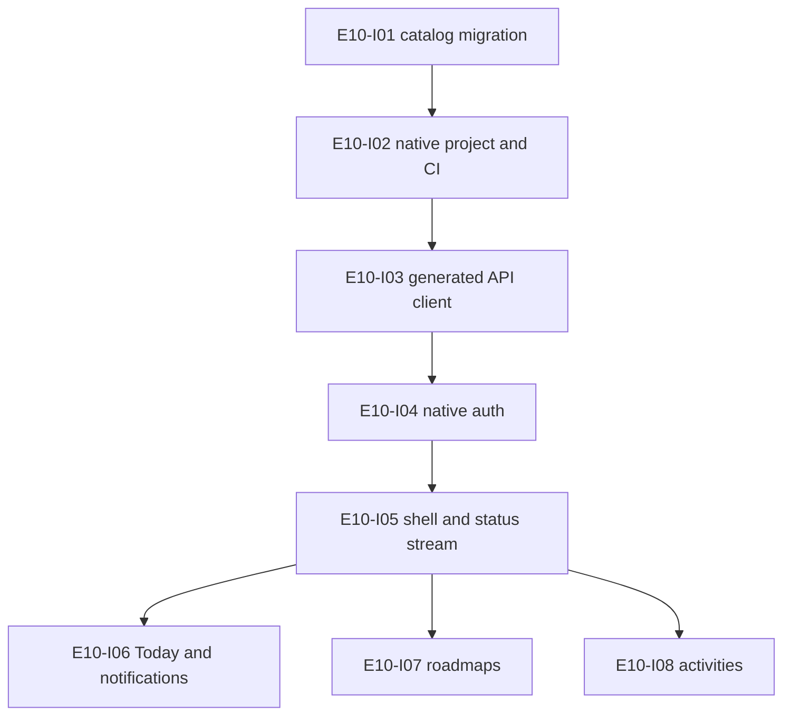

# TAM Forge Native macOS Batch 01 Implementation Plan

> **Status:** Locked on 2026-08-28 after approval of D1–D3. Planning model: `gpt-5.6-sol` / `ultra`. Execution coordinator: `gpt-5.6-sol` / `xhigh`. Implementation starts only after the user switches this task to the execution setting and replies `continue`.

**Goal:** Migrate the planning catalog to the native architecture, establish a production-grade SwiftUI application and native authentication/API foundation, then migrate Today, notifications, roadmap administration, and the universal activity workspace without removing the working React parity reference.

**Batch size:** Eight heavy tickets. They form one dependency-coherent slice and three reviewable implementation PRs.

**Architecture:** Use a Swift 6/macOS 15 app with generated OpenAPI types, `URLSession`, `ASWebAuthenticationSession`, Keychain credentials, Swift concurrency actors, and feature-local SwiftUI state. Keep FastAPI/PostgreSQL authoritative. Preserve the React client until a later parity gate.

**Design source:** `docs/superpowers/specs/2026-08-28-tam-forge-native-macos-redesign.md`

## 1. Preconditions and stop conditions

- Full Xcode must be installed and selected. Command Line Tools alone are insufficient for the app, UI tests, signing, entitlements, and ScreenCaptureKit work.
- The Mac currently has about 29 GiB free. Installation must leave enough room for Xcode, build products, and the future 8 GiB recording reserve. Stop before installation or cleanup and ask for approval if additional disk must be freed.
- Start from a clean worktree based on the exact current `origin/main` head. Preserve unrelated work and the old `codex/recording-speech` branch.
- Do not run Docker, Testcontainers, Compose, or a test suite that may auto-start them without explicit approval in that execution turn.
- Do not modify Hetzner, Gastos, Caddy, DNS, production databases, object-storage policy, or production secrets in this batch.
- Do not install a paid service, enroll in a paid Apple program, or create paid API usage without explicit approval.
- Do not delete `apps/web`, Node/pnpm configuration, browser OAuth, or web CI in this batch.
- Do not merge without explicit approval. Local checks are not CI; exact-final-head CI is required.
- Planning snapshot: `origin/main` `6cdced2104cd2239011d1212c82ba4d73728851b`; 114 managed GitHub issues, 97 open and 17 closed; existing-manifest dry-run create/update/stale counts all zero. Revalidate immediately before E10-I01.

## 2. Issue-catalog migration blueprint

### 2.1 New M0 epic E10 — Native macOS application and web parity

| Key | Proposed title | Dependency summary | Planned route |
|---|---|---|---|
| E10-I01 | Add execution routing and native macOS taxonomy to the issue catalog | Existing issue synchronizer | Terra high worker; Sol xhigh owns external sync |
| E10-I02 | Bootstrap the Swift 6 macOS 15 app, tests, and CI | E10-I01, completed repository CI | Terra xhigh |
| E10-I03 | Generate the typed Swift OpenAPI client and URLSession transport | E10-I02, current FastAPI schema | Terra xhigh |
| E10-I04 | Implement native GitHub OAuth exchange, token rotation, and Keychain storage | E10-I03, completed owner-restricted OAuth | Sol xhigh coordinator |
| E10-I05 | Implement the SwiftUI shell, navigation, session states, and status stream | E10-I03, E10-I04 | Terra xhigh |
| E10-I06 | Migrate Today and notifications to SwiftUI | E10-I05, completed Today/notification backend | Terra xhigh |
| E10-I07 | Migrate roadmap import, validation, diff, approval, and activation to SwiftUI | E10-I05, completed roadmap backend | Terra xhigh |
| E10-I08 | Migrate activity workspace, timers, artifacts, commit, and self-review to SwiftUI | E10-I05, completed activity backend | Terra xhigh |
| E10-I09 | Migrate the evidence ledger and confidence/portfolio explanations to SwiftUI | E10-I05, completed evidence backend | Terra xhigh |
| E10-I10 | Prove native parity and remove React/Vite/Node from runtime and CI | E10-I06–I09 | Sol xhigh coordinator |

Batch 01 executes E10-I01 through E10-I08. E10-I09 and E10-I10 remain behind a later Ultra planning gate.

### 2.2 Rewritten E3 — Durable native macOS recording

| Existing key | Replacement title | Primary change |
|---|---|---|
| E3-I01 | Specify the versioned recording manifest and resumable HTTPS upload contract | Replace 44.1 kHz WSS frames with 48 kHz post-recording REST parts |
| E3-I02 | Implement recording permissions, all-Mac coverage prototype, preflight, and audio diagnostics | Replace recorder pairing/Tkinter setup; prove app/display/route coverage before locking stream topology; native auth is E10-I04 |
| E3-I03 | Capture separate synchronized 48 kHz microphone and all shareable Mac audio tracks | Use the minimum proven broad ScreenCaptureKit topology; include TAM Forge TTS; no BlackHole or live monitoring |
| E3-I04 | Implement callback-safe conversion, bounded buffering, and timeline accounting | Preserve bounded-callback intent with Swift actors and sample timestamps |
| E3-I05 | Implement the encrypted crash-recoverable bounded local spool | Replace SQLite/Python assumptions with chunked CryptoKit AEAD records |
| E3-I06 | Implement resumable URLSession upload and local recovery coordination | Replace live WSS sender/high-water controls |
| E3-I07 | Implement authenticated recording session, track, part, and seal endpoints | Reuse native bearer auth; no recorder identity |
| E3-I08 | Persist verified immutable recording parts and transactional high-water state | Adapt useful idempotency ideas from the old branch to 48 kHz REST parts |
| E3-I09 | Seal manifests, reconcile orphans, and finalize canonical server originals | Hash-verified permanent originals and explicit gaps |
| E3-I10 | Run all-app coverage, route, interruption, crash, disk, duplicate, reorder, corruption, and permission tests | Zoom/Teams/Meet/browser/TAM Forge audio, app/display placement, and native/backend failure matrix |
| E3-I11 | Benchmark PCM format plus 10/60/120-minute resource and spool behavior | M2/8 GB evidence; PCM16 versus PCM24 value gate |
| E3-I12 | Build the stable-signed app/DMG and prove permission persistence | Replace PyInstaller/ad-hoc-only packaging |

All E3 execution defaults to Sol xhigh because audio, concurrency, crypto, recovery, and persistence contracts are coupled. A later Ultra turn may delegate a demonstrably mechanical test/fixture sub-slice to Terra high.

### 2.3 Rewritten E4 — Local transcription and English measurement

| Existing key | Replacement title or action | Planned route |
|---|---|---|
| E4-I01 | Integrate speech-analysis jobs and workers with the existing durable queue and outbox | Sol xhigh; queue primitives already exist, worker registration/priority/recovery remain |
| E4-I02 | Implement versioned 16 kHz mono derivation and audio-quality lineage | Sol xhigh |
| E4-I03 | Integrate pinned whisper.cpp, built-in VAD, Metal, and optional Core ML | Sol xhigh |
| E4-I04 | Benchmark and select quantized Base.en versus Small.en on Francisco's voice | Sol xhigh |
| E4-I05 | Implement transcript, word, uncertainty, correction, and model lineage | Sol xhigh |
| E4-I06 | Implement deterministic pace, pause, filler, restart, and latency metrics | Terra xhigh |
| E4-I07 | Build M2/8 GB 10/60-minute speech performance and cleanup harness | Sol xhigh |
| E4-I08 | Build the private voice gold-set manifest and adjudication tooling | Terra high |
| E4-I09 | Benchmark dedicated server-side pronunciation/alignment candidates on original audio | Sol xhigh |
| E4-I10 | Implement the calibrated server-side pronunciation pipeline and SwiftUI diagnostic | Terra xhigh after E4-I09 gate |
| E4-I11 | Enforce decision-grade transcription, timing, pause, and pronunciation gates | Sol xhigh |
| E4-I12 | Implement one-at-a-time local speech scheduling and memory-pressure recovery | Sol xhigh |

### 2.4 Existing epics retained with targeted edits

- **E1:** Keep E1-I06–I10. Replace E1-I11's nonexistent React privacy-page check with backup/restore policy tests. Route E1-I06–I11 to Sol xhigh because they touch production inventory, encryption, destructive gating, host hardening, or recovery.
- **E2:** Keep all closed issues unchanged as historical evidence. Do not reopen completed React tickets.
- **E5:** Preserve the closed evidence/correction rules. Replace browser component checks in E5-I04–I09 with backend contract plus Swift feature tests. Route E5-I02, I03, I09, and I11 to Sol xhigh; E5-I01 and I04–I10 otherwise to Terra xhigh.
- **E6:** Preserve Agent SDK and memory intent. Change E6-I06 to native SwiftUI/TTS verification. Rename E6-I08 to **Implement server-side embeddings, relational filtering, and pgvector retrieval** so it cannot be interpreted as Mac inference. Route I02–I04, I06–I08, and I10 to Sol xhigh; I01 to Terra high; I05, I09, I11, and I12 to Terra xhigh.
- **E7:** Preserve opportunity, consent, privacy, and real-interview intent. Change all workspaces/debrief/timeline/correction UI to Swift. Rename E7-I07 to **Implement question segmentation, synchronized two-track timeline, and user/remote attribution**; do not add remote-speaker diarization until evidence requires it. Route I01, I03, I04, I06, I07, and I10 to Sol xhigh; I02, I05, I08, and I09 to Terra xhigh.
- **E8:** Replace `area/web` with `area/macos` and add Swift acceptance/UI evidence to every user-facing workspace. Route I01, I08–I11 to Sol xhigh; I02–I07, I12, and I13 to Terra xhigh.
- **E9:** Replace export/privacy browser checks with Swift tests and make the release ticket prove the native app/DMG. Route I01–I04, I06, I08–I12 to Sol xhigh; I07 to Terra xhigh; optional deterministic OKF adapter I05 to Terra high.

### 2.5 Execution metadata rendered into each child issue

```yaml
execution:
  owner: coordinator | subagent
  model: gpt-5.6-sol | gpt-5.6-terra
  effort: xhigh | high
  reason: <bounded risk-based reason>
  dispatch_gate:
    - <facts and dependencies required before dispatch>
  escalation_triggers:
    - <conditions that return ownership to Sol xhigh or Sol Ultra>
```

The synchronizer validates allowed model/effort pairs, nonempty reasons/gates/triggers, and renders them in the managed GitHub body. A child cannot be dispatched merely because the model field exists: its batch-specific Ultra plan must also be locked.

## 3. Batch execution order and PR boundaries



- **PR A — planning catalog:** E10-I01 only. Exact live-issue dry run is reviewed before applying the GitHub update.
- **PR B — native foundation:** E10-I02 through E10-I05, with logical commits per ticket. These tickets share project/API/auth shell surfaces and execute serially.
- **PR C — native feature migration:** E10-I06 through E10-I08. After E10-I05, workers may operate in parallel only inside disjoint feature/test directories; the coordinator owns shared shell/API changes and integration.

## 4. Ticket E10-I01 — Catalog routing and native taxonomy

**Owner / model:** Subagent, `gpt-5.6-terra` / `high`; Sol xhigh coordinator performs final review and external GitHub apply.

**Reason:** The parser/renderer/test work is deterministic and strongly testable. Live issue reconciliation and broad semantic review remain with the coordinator.

**Depends on:** Locked D1–D3 decisions; clean current GitHub snapshot; current sync tests passing.

**Files:**

- Modify `scripts/github/sync_issues.py`
- Modify `scripts/github/tests/test_sync_issues.py`
- Modify `docs/project/github-issues.yml`
- Modify `docs/superpowers/plans/2026-08-25-tam-forge-master-implementation-plan.md`
- Reference the native redesign and this plan; do not rewrite historical completed child plans

**Contracts and acceptance:**

- [ ] Add `area/macos` without deleting the historical `area/web` label.
- [ ] Add E10 and its ten children to M0 with a valid dependency DAG.
- [ ] Add validated execution metadata to every executable open child issue; closed historical children remain stable unless a factual verification pointer is wrong.
- [ ] Rewrite E3/E4 and targeted E1/E5–E9 issue fields exactly as the approved blueprint.
- [ ] Rewrite E4-I01 so it reuses the merged queue and owns only speech-specific worker registration, priority, outbox status, and recovery.
- [ ] Update fixed catalog counts and expected epic keys intentionally.
- [ ] Render model, effort, owner, reason, dispatch gate, and escalation triggers in managed bodies.
- [ ] A full dry run identifies only intended labels/issues and creates no duplicate stable keys.
- [ ] External apply remains a separate coordinator action after review; no issue is closed automatically.

**TDD and verification:**

1. Add failing tests for execution schema, invalid pairs, missing gates/triggers, body rendering, E10 counts, and the new dependency graph.
2. Implement the minimum parser/renderer changes.
3. Update the manifest and exact-title/routing assertions.
4. Run:

```bash
uv run pytest scripts/github/tests/test_sync_issues.py -q
uv run python scripts/github/sync_issues.py --repo fgomensoro/tam-forge --manifest docs/project/github-issues.yml --dry-run
```

**Privacy/recovery:** No private issue content or secrets. Dry-run precedes every write. Stop if live markers, titles, states, counts, or repository identity differ from the planning snapshot.

**Completion evidence:** Focused tests green; reviewed dry-run artifact; exact diff of managed issues; coordinator-applied no-duplicate sync; E4-I01 no longer asks future work to rebuild merged queue primitives.

**Dispatch gate:** D1–D3 answered; redesign and batch plan locked; live issue count/state and `origin/main` revalidated; worker receives local-only write scope with no GitHub apply authority.

**Escalate when:** Schema needs a new routing lane, stale/ambiguous markers appear, a dependency cycle emerges, current issue state changed, or sync would modify closed issue history materially.

## 5. Ticket E10-I02 — Swift app, tests, and CI

**Owner / model:** Subagent, `gpt-5.6-terra` / `xhigh`.

**Reason:** Normal production SwiftUI foundation with clear platform contracts; no audio/auth migration yet.

**Depends on:** E10-I01; full Xcode installed/selected; signing choice recorded but no final release identity needed for unit tests.

**Files:**

- Create `apps/macos/TAMForge.xcodeproj`
- Create `apps/macos/TAMForge/App/`
- Create `apps/macos/TAMForge/Core/`
- Create `apps/macos/TAMForgeTests/`
- Create `apps/macos/TAMForgeUITests/`
- Modify `.github/workflows/ci.yml`, `.gitignore`, `Makefile`, `README.md`

**Contracts and acceptance:**

- [ ] macOS 15 minimum, Swift 6 strict concurrency, deterministic bundle identifier, and English-only empty shell.
- [ ] App target, unit target, UI target, Debug/Release schemes, hardened runtime, App Sandbox, least-privilege entitlements, and privacy strings are explicit. Allow outbound network, microphone, user-selected file reads, and app-container storage only; no blanket filesystem access.
- [ ] No CocoaPods, state framework, DI framework, embedded runtime, or generated project tool.
- [ ] A dependency container exposes protocol-based API/auth/status services without global mutable state.
- [ ] `make check` remains non-Docker and adds a focused native check when Xcode is available.
- [ ] GitHub CI has a scoped macOS build/unit job; React CI remains until cutover.
- [ ] Build artifacts, local signing data, DerivedData, private audio, and model binaries are ignored.

**TDD and verification:**

```bash
xcodebuild -project apps/macos/TAMForge.xcodeproj -scheme TAMForge -destination 'platform=macOS' build
xcodebuild -project apps/macos/TAMForge.xcodeproj -scheme TAMForge -destination 'platform=macOS' test
uv run python scripts/ci/check_repository_policy.py
```

Start with failing tests for app composition, environment selection, and no-secret diagnostics. UI smoke asserts the TAM Forge shell opens and is keyboard reachable.

**Performance/UX:** Empty-shell settled RSS is measured, not asserted from a simulator. No background polling before authentication. Native semantic controls and accessibility identifiers are required from the first screen.

**Completion evidence:** Clean build/test, CI job green on exact head, dependency audit, app bundle inspection, and measured baseline RSS recorded.

**Dispatch gate:** Xcode and SDK versions recorded; no overlapping project-file writer.

**Escalate when:** Required entitlement or signing behavior changes architecture; package/plugin cannot build reproducibly; strict-concurrency warnings require unsafe isolation; CI runner/toolchain differs materially.

## 6. Ticket E10-I03 — Generated API client and URLSession transport

**Owner / model:** Same native-foundation subagent, `gpt-5.6-terra` / `xhigh`, serialized after E10-I02.

**Reason:** Well-specified production integration. Shared project/API files make a fresh parallel writer unsafe.

**Depends on:** E10-I02; current FastAPI OpenAPI document.

**Files:**

- Create `apps/macos/TAMForge/Core/API/`
- Create checked/generated OpenAPI input and generator configuration under `apps/macos/`
- Modify `scripts/ci/check_openapi.py`
- Modify focused OpenAPI tests and CI

**Contracts and acceptance:**

- [ ] FastAPI remains the schema source; Swift request/response DTOs are generated, never copied by hand.
- [ ] Use pinned Swift OpenAPI Generator/runtime and URLSession transport versions.
- [ ] Wrap transport only for base URL, bearer injection hook, idempotency keys, RFC 9457 problem mapping, timeout policy, redacted diagnostics, and test injection.
- [ ] Mutations have stable caller-provided idempotency keys across retry.
- [ ] Multipart roadmap/artifact support is bounded and file-backed where payloads can be large.
- [ ] Existing TypeScript generation remains valid until E10-I10.
- [ ] Drift check fails when FastAPI schema and checked native input differ.

**TDD and verification:** Use a custom `URLProtocol` fixture to prove methods, paths, headers, 204 handling, typed success, malformed problem fallback, 401 notification, retry idempotency, cancellation, and log redaction. Run native tests plus:

```bash
uv run python scripts/ci/check_openapi.py
```

**Privacy/recovery:** Disable sensitive HTTP disk caching; never log bodies or authorization headers. Retriable commands surface indeterminate state and reconcile through GET rather than blindly creating a new key.

**Completion evidence:** Generated client compiles on CI; drift test and transport suite green; dependency lock reviewed; no handwritten duplicate API models.

**Dispatch gate:** E10-I02 merged into the working branch; backend schema snapshot unchanged.

**Escalate when:** Generator cannot express an endpoint without unsafe custom DTOs, streaming changes the shared API boundary, or auth requires cookie emulation.

## 7. Ticket E10-I04 — Native OAuth and Keychain

**Owner / model:** Coordinator, `gpt-5.6-sol` / `xhigh`.

**Reason:** Cross-cutting auth, token rotation, Keychain, migration, browser callback, and dual-channel FastAPI authorization are high risk.

**Depends on:** E10-I03; approved signing choice; existing browser OAuth tests green.

**Files:**

- Modify `apps/backend/src/tamforge_backend/auth/`
- Add one Alembic revision for native authorization/exchange/session records
- Add focused backend auth unit/integration tests
- Create `apps/macos/TAMForge/Core/Auth/`
- Create native auth/Keychain tests
- Update generated OpenAPI input/client

**Contracts and acceptance:**

- [ ] `ASWebAuthenticationSession` uses the fixed callback scheme; no embedded browser.
- [ ] State and PKCE bind a short-lived single-use exchange code to the initiating app flow.
- [ ] GitHub identity is still restricted to the immutable numeric owner ID.
- [ ] Access token is short-lived and memory-only; refresh token rotates and is stored only in Keychain; database stores hashes only.
- [ ] Reuse of an exchange code or rotated refresh token fails closed and emits redacted audit evidence.
- [ ] Unified FastAPI dependencies support cookie+CSRF during migration and bearer auth for native requests. Owner scoping and mutation audit remain identical.
- [ ] Logout/revocation clears Keychain state and invalidates server credentials. Offline logout fails closed locally and records server revocation as pending without exposing the token.
- [ ] Secrets never appear in URLs after the one-time bounded callback code, logs, errors, OpenAPI examples, fixtures, or crash diagnostics.

**TDD and verification:** Write failing pure/service tests before routes and migration. Cover state mismatch, PKCE mismatch, expiry, replay, wrong GitHub ID, rotation race, revoked token, cookie regression, bearer mutation, audit redaction, and Keychain not-found/denied paths. Run focused backend unit tests and native tests. PostgreSQL integration waits for CI or explicit Docker approval.

**Recovery/security:** Access-token refresh is single-flight. A 401 retries at most once after rotation. Indeterminate rotation triggers reauthentication rather than accepting two refresh tokens. Migration downgrade refuses unsafe loss if active native sessions exist or documents the explicit revocation behavior.

**Completion evidence:** Threat-model checklist, focused unit tests, isolated migration CI, native login/logout smoke, Keychain inspection showing generic-secret storage, and independent security review on exact head.

**Dispatch gate:** Native callback bundle ID/scheme fixed; backend callback URL verified; no overlapping auth writer.

**Escalate when:** OAuth provider/config must change, paid Apple capability is required, custom URL callback cannot be bound safely, migration affects existing sessions unexpectedly, or any token might enter logs/URLs persistently.

## 8. Ticket E10-I05 — SwiftUI shell and status stream

**Owner / model:** Native-foundation subagent, `gpt-5.6-terra` / `xhigh`, after coordinator lands E10-I04.

**Reason:** Normal production SwiftUI and networking behavior over locked auth/API contracts.

**Depends on:** E10-I03, E10-I04.

**Files:**

- Modify `apps/macos/TAMForge/App/`
- Create `apps/macos/TAMForge/Core/Diagnostics/`
- Create `apps/macos/TAMForge/Features/Notifications/StatusStreamClient.swift`
- Add shell/session/status tests

**Contracts and acceptance:**

- [ ] `NavigationSplitView` exposes authenticated product destinations only when their native slice exists; Batch 01 lands Today, Roadmaps, and contextual Activity with no dead Evidence placeholder. E10-I09 adds Evidence.
- [ ] Session expiration returns to login and clears sensitive in-memory feature state.
- [ ] Native SSE parser supports bearer auth, event IDs, reconnect with `Last-Event-ID`, bounded backoff, duplicate suppression, cancellation, and fallback polling.
- [ ] Global banners distinguish offline, retrying, permission, processing, and actionable failure states without exposing internals.
- [ ] Navigation restoration stores only nonsensitive route identifiers.
- [ ] Keyboard, VoiceOver, focus, reduced motion, empty, loading, and failure behavior is covered.

**TDD and verification:** Reducer/view-model tests first; stream fixture tests for partial lines, UTF-8 boundaries, reconnect, duplicate event, 401, cancellation, and malformed event. UI smoke covers login shell, sidebar navigation, offline banner, and sign-out.

**Performance/UX:** No always-running timer or reconnect loop while signed out. Backoff is bounded and jittered. Status history is bounded in memory.

**Completion evidence:** Native unit/UI tests, accessibility inspection, reconnect fixture evidence, no-secret diagnostics snapshot, and CI green.

**Dispatch gate:** Auth/API contracts merged and regenerated; shared shell files reserved to this worker.

**Escalate when:** Existing SSE semantics cannot support replay safely, UI requires a new backend read model, or shared state begins duplicating server authority.

## 9. Ticket E10-I06 — Today and notifications

**Owner / model:** Feature subagent, `gpt-5.6-terra` / `xhigh`.

**Reason:** Well-specified parity work over completed backend endpoints, with objective fixtures and UI tests.

**Depends on:** E10-I05; completed E2-I11/I12 behavior.

**Write scope:** `Features/Today/`, `Features/Notifications/`, their tests, and explicitly assigned API adapters only. Do not edit shared shell/auth/generated files without coordinator handoff.

**Contracts and acceptance:**

- [ ] Preserve local-date/timezone semantics, task cards, primary Continue destination, day status, focused minutes, and daily-close command.
- [ ] Preserve no-invented-work, Sunday-off, hard-stop, and resumability cues from backend read models.
- [ ] Render allowed notifications and processing states; mark-read is idempotent and reconciles after an indeterminate response.
- [ ] SSE invalidates narrow reads rather than duplicating server domain state.
- [ ] Loading, empty, partial, stale, offline, retry, and server-problem states are actionable and accessible.

**TDD and verification:** Use recorded redacted backend fixtures. Test date boundaries, Continue routing, duplicate status events, daily-close validation/idempotency, notification read retry, 401, and offline recovery. Add UI tests for Today → Activity navigation and daily close.

**Completion evidence:** Feature/unit/UI tests, parity checklist against current React behavior, accessibility pass, and exact-head CI.

**Dispatch gate:** E10-I05 merged; feature API surface frozen; disjoint write scope confirmed.

**Escalate when:** Backend read model lacks parity data, route semantics conflict with native navigation, or changes would alter protected-time domain rules.

## 10. Ticket E10-I07 — Roadmap administration

**Owner / model:** Feature subagent, `gpt-5.6-terra` / `xhigh`.

**Reason:** Production SwiftUI file/multipart workflow over a completed validated backend.

**Depends on:** E10-I05; completed E2-I02–I04.

**Write scope:** `Features/Roadmaps/`, its tests, and explicitly assigned multipart adapters only.

**Contracts and acceptance:**

- [ ] `NSOpenPanel` selects either one ZIP or one folder; the app never reads the configured Obsidian vault automatically.
- [ ] Folder entries preserve normalized relative paths and use the existing `folder_entries` multipart API; no new ZIP dependency is introduced.
- [ ] Stage, validation report, semantic diff, approval, mirror retry, version history, and activation states match backend behavior.
- [ ] Selection/import is cancelable, bounded, file-backed where possible, and reuses the same idempotency key on retry.
- [ ] Explicit approval remains mandatory before activation; mirror failure is visible but does not falsify runtime activation.
- [ ] Security-scoped access is released after upload; paths and source content never enter logs.

**TDD and verification:** Fixtures cover ZIP, nested folder, invalid path, duplicate normalized path, oversized package response, cancellation, retry, mirror failure, and activation conflict. UI test covers select → validate → approve → activate with fake transport.

**Completion evidence:** Unit/UI tests, multipart request inspection, file-access cleanup test, React parity checklist, accessibility pass, and CI.

**Dispatch gate:** Shared multipart contract from E10-I03 is stable; no simultaneous writer in API transport.

**Escalate when:** Native folder upload requires changing backend validation, large files force a transport redesign, or sandbox/signing choice changes file access materially.

## 11. Ticket E10-I08 — Universal activity workspace

**Owner / model:** Feature subagent, `gpt-5.6-terra` / `xhigh`.

**Reason:** Large but well-specified production feature over completed state-machine and artifact APIs. Strong behavior fixtures make delegation safe after the shell contracts lock.

**Depends on:** E10-I05; completed E2-I06–I08.

**Write scope:** `Features/Activities/`, its tests, and explicitly assigned artifact-upload adapter only.

**Contracts and acceptance:**

- [ ] Preserve objective/task contract, source show/hide, Markdown/text/SQL/result inputs, arbitrary artifact attachment, assistance metadata, immutable output commit, self-review, timer start/pause/resume/heartbeat, and incomplete classification.
- [ ] Feedback remains locked until self-review; native UI cannot bypass server transitions.
- [ ] Draft text remains in memory through navigation and transient network errors but is not treated as committed evidence.
- [ ] Artifact upload follows presign → file upload → confirm, surfaces indeterminate state, and reconciles before retrying confirm.
- [ ] Timer display derives from server state plus monotonic local interpolation; wall-clock changes cannot invent focused time.
- [ ] App termination, sleep/wake, stale activity, duplicate command, expired presign, and upload cancellation have explicit recovery states.
- [ ] No AI-generated Attempt A path is introduced.

**TDD and verification:** Port existing React behavior fixtures into Swift view-model tests; add state-transition, timer-clock, draft, output-payload, self-review gate, artifact lifecycle, idempotency, cancellation, 401, and UI journey tests. Backend domain tests remain the authority and run focused without Docker.

**Performance/UX/privacy:** Large source/output text uses lazy views and bounded rendering. Artifact bytes are streamed from file, never loaded whole into memory. Temporary upload data is deleted after success/cancel. Accessibility covers editor labels, timer announcements without chatter, and keyboard-only completion.

**Completion evidence:** Focused backend tests, native unit/UI tests, React parity matrix, artifact memory check, accessibility pass, and CI on exact head.

**Dispatch gate:** E10-I05 merged; activity API fixture frozen; disjoint feature scope; coordinator reserves shared navigation/API files.

**Escalate when:** A backend transition is missing, artifact transport cannot remain file-backed, timer correctness requires schema changes, or parity would weaken independent-attempt/self-review rules.

## 12. Batch-level verification and handoff evidence

Before claiming Batch 01 complete:

1. Run every focused command named above without Docker.
2. Run the repository's non-Docker `make check` after it includes the native target.
3. Review the final diff for secrets, binary/model artifacts, handwritten API duplication, unsafe concurrency, and accidental web removal.
4. Obtain independent code/security review for native auth and the final integrated head.
5. Push without force; bind PR review and CI to the exact final head SHA.
6. Report each ticket as complete only with its stated evidence. A created PR is not a merge; a merge is not deployment.
7. Stop for explicit merge approval.

## 13. Planned execution routing

| Cluster | Tickets | Model / effort | Execution rule |
|---|---|---|---|
| Coordinator/high risk | E10-I04; integration; live issue apply | `gpt-5.6-sol` / `xhigh` | Coordinator owns auth, migrations, conflicts, review, CI, and external writes |
| Catalog mechanics | E10-I01 local changes | `gpt-5.6-terra` / `high` | One bounded worker; coordinator reviews semantics and applies sync |
| Shared native foundation | E10-I02, E10-I03, E10-I05 | `gpt-5.6-terra` / `xhigh` | One worker, serial, because project/API/shell files overlap |
| Today/notifications | E10-I06 | `gpt-5.6-terra` / `xhigh` | May parallelize after E10-I05 with disjoint feature scope |
| Roadmaps | E10-I07 | `gpt-5.6-terra` / `xhigh` | May parallelize after E10-I05 with disjoint feature scope |
| Activities | E10-I08 | `gpt-5.6-terra` / `xhigh` | May parallelize after E10-I05; largest feature worker; no shared-file edits |

If any Terra lane discovers audio, crypto, auth, migration, architecture, cross-feature state, or unclear privacy behavior, it stops and returns evidence to the Sol xhigh coordinator. A material architecture decision returns the batch to Sol Ultra for re-locking.
