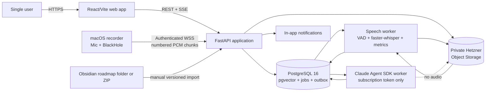

# TAM Forge — Product and Architecture Design

**Status:** Approved; independent specification review complete

**Date:** 2026-08-25

**Product:** TAM Forge

**Repository:** Private personal GitHub repository, `tam-forge`
**Owner and only user:** Francisco Gomensoro

## 1. Purpose

TAM Forge is a private learning and interview-practice application whose primary outcome is strong Technical Account Manager interview performance that leads to a job offer within three months.

The application turns a fixed, human-authored curriculum into a daily study workspace, captures independent performance evidence, analyzes that evidence asynchronously, and carries a small number of high-value corrections into later practice. It must improve real performance rather than maximize activity, recordings, time in the app, or other vanity metrics.

All study content, attempts, transcripts, self-reviews, and AI feedback are in English.

Secondary outcomes are stronger:

- real-world TAM judgment;
- technical and business communication;
- spoken English;
- technical reasoning;
- SQL and reconciliation ability;
- incident, implementation, customer, and account-management judgment.

## 2. Product principles and hard constraints

### 2.1 Stable spine, adaptive edges

The imported roadmap is the stable spine. It controls:

- subjects and assigned resources;
- required daily and weekly coverage;
- daily time allocation;
- required outputs and assessments;
- pass criteria and month exit criteria;
- Saturday assessments and Sunday rest.

AI may adapt only the edges:

- prompt and scenario selection;
- difficulty, audience, ambiguity, and pressure;
- follow-up questions;
- which weak concept returns;
- the two corrections carried into the next lesson.

Every adaptation is stored with what changed, why, supporting evidence, the roadmap objective it serves, and whether it affects required coverage or time. AI cannot silently alter the stable spine.

### 2.2 Independent evidence before assistance

The core learning loop is:

1. objective;
2. independent recall or attempt;
3. assigned learning input;
4. production;
5. self-assessment;
6. evidence saved;
7. asynchronous AI analysis;
8. correction carried forward;
9. later retrieval in a different scenario.

AI must not create the original answer before the learner commits an attempt. Saved attempts are uninterrupted. AI feedback is locked until the mandatory self-review is complete.

### 2.3 Evidence, not activity

A competency advances only through an independent Attempt A, a no-AI assessment, a mock, or real-interview evidence. Coach-assisted work can prepare performance but cannot demonstrate it.

Self-score and AI score remain separate. The difference measures self-assessment calibration.

### 2.4 Time protection

- Weekdays target 240 focused minutes, acceptable range 225–255 minutes, with a hard-stop recommendation at 255 minutes.
- Saturday has a 120-minute maximum.
- Sunday is completely off: no catch-up, study reminders, or invented work.
- Finishing early is allowed once required outputs and pass conditions are satisfied.
- Asynchronous transcription and analysis do not count as study time.
- Real interviews replace relevant study blocks and count toward the daily budget.

### 2.5 Data integrity and privacy

- Original evidence is immutable and never overwritten.
- Practice and real-interview recordings are strictly separated.
- Original audio is never sent to Claude.
- Real-interview text is sent to Claude only after the user approves a redacted version.
- No DataNest or employer-derived material belongs in this application.
- No live AI answer assistance is allowed in real interviews.
- The complete learning history must remain exportable without vendor lock-in.

## 3. Source material and roadmap ownership

The current Month 1 roadmap in the Obsidian vault is the canonical human-authored source:

`/Users/frank/Library/Mobile Documents/iCloud~md~obsidian/Documents/Frank/Personal/TAM Practice/Roadmap`

Initial source material includes its README, four weekly files, month and portfolio documents, cases, SQL setup and tasks, and templates. The application must preserve the approved learning process rather than rewrite or redesign it.

### 3.1 Obsidian and PostgreSQL responsibilities

Obsidian remains the editing and authoring environment. TAM Forge does not edit the vault.

On import, TAM Forge:

1. receives a selected folder or ZIP;
2. calculates a content manifest and hashes;
3. validates the roadmap structure and referenced files;
4. shows a preview and validation report;
5. waits for explicit approval;
6. stores an immutable source snapshot in object storage;
7. mirrors the immutable manifest and approved source snapshot in the private personal GitHub repository for auditability;
8. stores the parsed, versioned runtime model in PostgreSQL;
9. links all activities and evidence to that exact roadmap version.

If Month 2 is later added in Obsidian, nothing changes automatically in active study. The new material is imported as a staged version, validated, semantically diffed against its predecessor, previewed, and activated only through an explicit user action after Month 1's final assessment and exit review. Prior versions and all evidence links remain intact. GitHub mirror failure is visible and retryable but never makes the runtime dependent on GitHub availability. The system never invents a missing future curriculum.

## 4. Product boundaries

### 4.1 First usable MVP

The MVP proves one complete, reliable spoken-practice learning loop:

- secure single-user authentication;
- import and activate the Month 1 roadmap;
- Today screen and resumable task state;
- a universal activity workspace with source display/hide, timer/resume, Markdown/text entry, SQL text and result attachment, arbitrary artifact attachment, assistance metadata, immutable commit, self-review, and evidence-packet creation;
- lightweight Mac recording with microphone and system-audio tracks;
- durable real-time upload to the remote backend;
- mandatory self-review;
- local transcription with word timestamps and uncertainty;
- deterministic speech metrics;
- a controlled clean-microphone pronunciation diagnostic using a known script, acoustic/phoneme alignment evidence, human-correctable targets, and a calibrated intelligibility rubric;
- separate English and TAM analysis;
- exactly two prioritized corrections;
- next-lesson Attempt B and A/B comparison;
- permanent evidence packet and competency updates;
- persistent role-aware memory for Planner, Tutor, Coach, Reviewer, and Analyst;
- basic opportunity and real-interview metadata needed to shape practice;
- export of MVP records and source artifacts.

### 4.2 Deferred from the first usable loop

These are part of the intended product but follow after the closed spoken loop works:

- full in-browser SQL execution, validation database, and specialized reconciliation workspace (the MVP still supports committed SQL text/results as evidence);
- complete career-pipeline CRM;
- advanced portfolio simulations and integrated mock panels;
- full written-artifact workflow;
- live, full-duplex Coach Mode;
- elaborate dashboards and predictive analytics;
- mobile applications;
- multi-user, team, billing, or organization features;
- external paid transcription or model fallbacks.

### 4.3 Explicit non-goals

- Replacing or automatically rewriting the curriculum.
- Providing answers during a live job interview.
- Scoring accent or trying to make the learner sound native.
- Claiming exact pronunciation quality from Whisper confidence.
- Sending complete history to every model call.
- Filling unused study time with generated work.
- Predicting interview outcomes from tone or incomplete evidence.
- Supporting iPhone Voice Memo ingestion in the initial product.
- Building an OKF-native runtime or graph database.
- Using Claude API credits or other pay-per-token model access.

## 5. Target platform and deployment

TAM Forge is a private web application with a remote backend and a separate lightweight macOS recorder.

### 5.1 Deployment target

The existing Hetzner server currently named `n8n-prod-gastos` becomes the dedicated TAM Forge server, ultimately renamed `tam-forge-prod`. The existing `lamas-prod` server is not changed and receives no Gastos or TAM Forge workloads.

Before repurposing the Gastos server:

1. create an encrypted archive of Gastos, n8n, NocoDB, PostgreSQL data, Caddy configuration, environment/configuration manifests, and any application files;
2. create checksums and a contents inventory;
3. perform a restore test in an isolated location;
4. record recovery instructions;
5. request a final explicit destructive-action confirmation;
6. only then remove the old workloads and harden/rebuild the server for TAM Forge.

This destructive gate is outside ordinary autonomous development.

### 5.2 Runtime components

- **Caddy:** TLS termination, secure headers, WebSocket proxying, and static frontend delivery.
- **React + TypeScript + Vite:** private study workspace.
- **FastAPI:** REST API, WebSocket recording ingest, authorization, domain orchestration, and server-sent events for job/status updates.
- **PostgreSQL 16 + pgvector:** canonical relational state, job queue, audit history, and retrieval index.
- **Hetzner Object Storage:** encrypted private storage for immutable audio, roadmap snapshots, transcripts, reports, and exports.
- **Speech worker:** local VAD, transcription, speaker/timing processing, and deterministic speech metrics.
- **Claude worker:** constrained Agent SDK orchestration over prepared text and metrics only.
- **macOS recorder:** a tiny Python/Tkinter desktop process for reliable low-memory capture and upload.

The first release uses a PostgreSQL-backed durable job queue and transactional outbox. Redis is deliberately omitted until measured load requires it.

### 5.3 Architecture



## 6. Component boundaries

### 6.1 Web client

The web client owns presentation and local interaction state only. It displays the active AI role at all times, restores resumable tasks, enforces UI locks for independent work, and never treats browser state as authoritative evidence.

### 6.2 API/application service

The application service owns authentication, authorization, workflow commands, state transitions, idempotency, curriculum import, evidence assembly, signed object access, and event publication. It validates all state transitions on the server.

### 6.3 Recording ingest service

The recording endpoint accepts authenticated, session-bound binary chunks. It validates sequence, track, format, size, and idempotency; writes immutable segments durably; and acknowledges only after durable persistence. It does not run transcription in the WebSocket request path.

### 6.4 Speech worker

The speech worker reads sealed source audio, produces versioned timestamped transcripts, labels uncertainty, computes deterministic metrics, and stores artifacts. It processes one transcription at a time initially and yields resources while a live recording is active.

### 6.5 Claude worker

The Claude worker receives the minimum prepared context required for a specific role and job. It has no access to original audio, shell commands, arbitrary files, arbitrary network requests, or raw SQL. Its outputs are validated structured data before becoming an analysis version or memory proposal.

### 6.6 Storage

PostgreSQL is canonical for relationships, states, provenance, scores, jobs, and memory. Object storage holds immutable large artifacts. pgvector is a derived retrieval index, not the source of truth.

## 7. Identity and access

The application has one authorized user, but still uses production authentication boundaries.

- GitHub OAuth is restricted to the owner's immutable personal GitHub user ID, not merely username or email.
- The web session uses secure, HTTP-only, same-site cookies and CSRF protection where applicable.
- The macOS recorder is paired once through the authenticated web app and receives a revocable scoped device token stored in macOS Keychain.
- Recorder tokens are limited to recording-session creation/upload functions and are rotatable.
- Object storage is private. Access uses short-lived signed URLs issued after authorization.
- Administrative and background-worker credentials are separate and least-privileged.
- Secrets live in host secret storage/environment configuration, never Git, PostgreSQL content fields, exports, or logs.

## 8. Study workspace and core user flows

### 8.1 Today screen

The Today screen shows:

- current roadmap version, week, and day;
- required blocks and total planned time;
- exactly two active corrections at most;
- scheduled interviews;
- self-reviews awaiting completion;
- analyses ready or needing attention;
- one primary **Continue** action.

Each task card shows objective, timebox, source/case, required output, pass criteria, allowed AI role, and evidence requirements.

### 8.2 Daily flow

The app instantiates the roadmap's required weekday structure without changing its allocation:

- Block 1: SQL 45 minutes, technical learning 45 minutes, career pipeline 30 minutes.
- Block 2: one correction warm-up 10 minutes, TAM case 60 minutes, communication/spoken work 35 minutes, daily close 15 minutes.

Timers and task state survive reload, disconnect, and logout. The system classifies unfinished work as required, useful, optional, or superseded without extending later days automatically.

That classification has deterministic consequences: required work is rescheduled by replacing a lower-priority adaptive task; useful work enters the retrieval queue; optional work is dropped; and superseded work is replaced by stronger real-interview evidence. Nothing is crammed onto a later day or added beyond its time limit.

### 8.3 Activity contracts

The detailed instructions in the active roadmap version are executable requirements, not descriptive suggestions. The runtime stores the applicable contract/version on every activity.

**Technical reading (45 minutes):** preview objective for 2 minutes; focused reading of assigned documentation for about 20; hide the source and perform closed-source recall for about 8; apply for about 10; teach back for about 5. The committed recall note contains three key ideas, one boundary/failure mode, one TAM/customer example, and one unresolved question. AI evaluates only after commitment and never replaces the learner's note with its own summary.

**SQL (45 minutes):** retrieve one previous mistake for 5 minutes; perform primary work without AI for 30; validate and explain query plus business meaning for 5; self-review and save for 5. Saved evidence includes query, result, explanation, timing, self-review, and assistance used. AI stays locked until an answer is committed or solving time expires. The hint ladder is strictly ordered: restate schema/requirement; ask a diagnostic question; point to the relevant concept; show a smaller analogous example; reveal a solution only after the attempt is saved. Mistakes use the roadmap's categories: schema misunderstanding, result grain, join, NULL, duplicate, filtering, aggregation, CTE/window, syntax, business interpretation, and time management. Saturday SQL is no-AI and determines demonstrated progress.

**TAM case (60 minutes):** understand for 5 minutes; discovery for 10; structure for 5; solve/produce for 25; present/defend for 10; self-review for 5. Evidence includes canonical prompt/facts, questions, assumptions, working notes, artifact, presentation audio/transcript, follow-ups, self-review, analysis, decisions, risks, and unresolved questions. A single weak segment becomes a later correction or new scenario; the whole case is not repeated. Cumulative cases such as Northstar preserve their complete fact/decision history, which AI cannot silently change.

**Written communication:** establish audience, requested action, facts, unknowns, tone, and limit; write Attempt A without AI; complete one self-edit; commit the independent draft; receive asynchronous analysis with two corrections; perform Attempt B in a future 10-minute correction slot; stop after that revision. AI cannot invent experience, metrics, decisions, or technical evidence.

**Career pipeline (30 minutes):** select for 5 minutes; produce for 20; record for 5. Every block ends in a concrete saved action/artifact linked to company/role, job-description snapshot, stage, next action, stories/competencies, known gaps, and interviews.

**Portfolio judgment:** activities require explicit prioritization, delegation, escalation, communication, proactive-work protection, and reprioritization when evidence changes. Decisions consider end-user/customer impact, financial/data/security/compliance risk, severity/blast radius, time sensitivity, deterioration, workaround quality, deadlines, strategic context, internal capacity, and diagnostic confidence. The largest or loudest customer is not automatically priority one. Month 1 progression remains Week 2 two competing incidents; Week 3 five-account reactive/proactive planning; Week 4 five-account triage followed by single-customer depth.

The weekly progression is also fixed: Monday retrieves corrections and introduces foundations; Tuesday–Wednesday apply/integrate and vary audience/context; Thursday adds pressure, ambiguity, pushback, and changing evidence; Friday integrates with reduced scaffolding under interview conditions; Saturday runs the no-AI/evidence-based assessment within 120 minutes; Sunday is off.

The daily close confirms the scorecard and evidence, records the strongest output and repeated mistake, classifies unfinished work, and confirms no more than two corrections for tomorrow.

### 8.4 Saved spoken attempt

1. The task displays prompt, audience, objective, and time limit.
2. The learner enters optional unsaved Coach Mode for at most 10–15 minutes when allowed.
3. The learner starts independent Attempt A.
4. The interviewer gives no coaching or interruption and asks no more than two routine follow-ups.
5. The recorder stores synchronized source tracks remotely.
6. The learner completes the mandatory 3–5 minute self-review: main answer/decision, what went well, where structure was weak, where the answer became vague, where hesitation occurred, what should change, and a separate self-score.
7. Background processing creates transcript, metrics, and analyses.
8. The app returns a short verdict, two demonstrated strengths, exactly two corrections, timestamped evidence, a compact improved structure, and Attempt B instructions.
9. Attempt B occurs at the beginning of the next lesson, lasts at most 10 minutes, and is saved without interruption.
10. The comparison is Improved, Partially improved, or Not improved. There is no Attempt C; unresolved weaknesses return later in a different scenario.

### 8.5 Turn-based interviewer orchestration

Routine saved practice is turn-based, not full duplex. Questions are generated before playback and spoken locally through browser or macOS speech synthesis; generated speech audio is not sent to or stored by Claude. Each answer remains uninterrupted.

```text
QuestionReady -> LocalTTSPlaying -> AnswerCapturing -> AnswerSealed
              -> PriorityTurnTranscript -> FollowupDecision
              -> NextQuestion | SessionSealed
```

Bulk post-session transcription yields while live recording is active. A bounded, priority per-turn transcript is allowed after an answer is sealed so the isolated Interviewer can choose a relevant follow-up. It uses only the prompt/canonical facts, current turn transcript, prior visible question/answer turns, and allowed scenario state—never hidden coaching or reviewer feedback. The maximum of two routine follow-ups is enforced by application state, not only the prompt.

For answers up to five minutes, the target from `AnswerSealed` to local playback of the next follow-up is p95 at or below 120 seconds. The feature remains gated until the target is demonstrated on the production server; a timeout seals the session or offers an explicit retry without coaching the completed answer.

### 8.6 Real interview

The real-interview lifecycle is a separate evidence path:

- before: company, role, stage, date, duration, interviewers, job description, competencies, research, questions, and consent/privacy metadata;
- final preparation window: no exhausting practice or new material during the final 60–90 minutes;
- during: original audio may be recorded only where permitted; no live AI assistance;
- immediately after: a private five-minute debrief is committed before AI feedback;
- processing: speaker-separated transcript, question segmentation, timeline, tested competencies, timestamped analysis, and two corrections;
- attribution: explicit interview content, learner recollection, AI inference, and unknowns are stored distinctly;
- next lesson: one corrected replay, followed later by transfer to a different scenario;
- outcome: stage and outcome data are tracked without overconfident pass/fail prediction.

At month close the system requires the final assessment, compares evidence with exit criteria, reviews interview outcomes, classifies competencies as advanced/stable/weak, and then waits for an explicitly supplied and activated next roadmap version.

## 9. Domain model

All durable records have permanent IDs, timestamps, provenance, and appropriate version/content hashes. Historical versions are append-only; corrections create new records rather than mutate source evidence.

### 9.1 Curriculum

- `RoadmapSource`: the external source and import method.
- `RoadmapVersion`: immutable snapshot, manifest, hash, validation status, and activation dates.
- `CurriculumNode`: month/week/day hierarchy.
- `TaskDefinition`: objective, timebox, AI role, required output, and evidence contract.
- `Resource`, `PassCriterion`, `ExitCriterion`: assigned material and deterministic requirements.

### 9.2 Study execution

- `StudyDay`: instantiated plan for a calendar date and roadmap version.
- `ActivityInstance`: resumable task state, timing, completion, and classification.
- `Attempt`: immutable learner output with assistance and assessment flags.
- `SelfReview`: learner reflection and self-score.
- `AdaptiveChange`: explicit adaptation explanation and supporting evidence.

### 9.3 Audio and artifacts

- `RecordingSession`: purpose, consent, capture format, state, and related attempt/interview.
- `AudioTrack`: microphone or system-audio track and synchronization metadata.
- `AudioSegment`: immutable sequence-numbered chunk/segment, checksum, byte length, and durability state.
- `Artifact`: content-addressed source or derived object with storage location, encryption metadata, and lineage.

### 9.4 Transcript and analysis

- `Transcript` and `TranscriptVersion`: raw, speaker-labeled, corrected, and analysis-selected versions.
- `WordToken`: word, timing, probability/uncertainty, speaker, and transcript version.
- `SpeakerSegment` and `UncertainSpan`: attribution and review needs.
- `PronunciationDiagnostic`: known-script version, clean-mic artifact, alignment engine/version, phoneme/word evidence, human corrections, calibration status, and intelligibility result.
- `RubricVersion` and `PromptVersion`: immutable evaluation contracts.
- `ModelRun`: provider/model, SDK version, parameters, context manifest, status, and usage/quota metadata.
- `AnalysisVersion`: immutable report tied to exact inputs.
- `Observation`: timestamped evidence and confidence.
- `DimensionScore`: rubric score with availability and evidence.
- `Correction`: priority, evidence, next action, and lifecycle.
- `AttemptComparison`: A/B result with comparable conditions.

### 9.5 Competency and evidence

- `Competency`: canonical skill definition and configurable target profile.
- `EvidenceItem`: immutable demonstrated-performance claim and provenance.
- `EvidenceCompetencyLink`: rubric mapping, weight, conditions, and confidence.
- `ConceptState`: Introduced, Applied, Demonstrated, or Needs work.

The initial fourteen canonical competencies are:

| Slug | Skill | Baseline | Month 1 target | Final target |
|---|---|---:|---:|---:|
| `api_integration_architecture` | API and integration architecture | 3.0 | 3.0 | 3.25 |
| `structured_troubleshooting` | Structured troubleshooting | 2.0 | 2.5 | 3.0 |
| `sql_reconciliation` | SQL and reconciliation | 1.0 | 2.0 | 2.75 |
| `distributed_systems_reliability` | Distributed systems and reliability | 2.0 | 2.5 | 3.0 |
| `payments_fintech_systems` | Payments and fintech systems | 2.0 | 2.5 | 3.0 |
| `technical_discovery` | Technical discovery | 2.0 | 2.5 | 3.0 |
| `incident_escalation_management` | Incident and escalation management | 2.0 | 2.5 | 3.0 |
| `implementation_project_management` | Implementation and project management | 2.0 | 2.5 | 2.75 |
| `proactive_account_strategy` | Proactive account strategy | 2.0 | 2.5 | 2.75 |
| `executive_communication` | Executive communication | 1.0 | 2.0 | 3.0 |
| `cross_functional_influence` | Cross-functional influence | 2.0 | 2.5 | 2.75 |
| `business_value_framing` | Business and value framing | 1.0 | 2.0 | 3.0 |
| `technical_writing` | Technical writing | 1.0 | 2.0 | 2.75 |
| `tam_english` | TAM English | 1.0 | 2.0 | 2.75 |

The 0–4 competency scale is: 0 not demonstrated/no practical knowledge; 1 heavily assisted/basic concepts; 2 developing/straightforward scenario; 3 independent under ambiguity and generally interview-ready; 4 strong under pressure and professional depth. Target profiles are configurable, while historical evidence and rubric versions remain stable.

### 9.6 Evidence ledger and skill calculation

Skill estimates are reproducible views over an inspectable evidence ledger. Raw performance quality and evidence strength are separate.

For every scored attempt:

```text
performanceScore =
  weightedSum(rubricDimensionScore * rubricDimensionWeight)
  / sum(rubricDimensionWeight)
```

The score remains on the 0–4 scale. Each `SkillEvidenceEvent` stores its raw rubric scores and weights, performance score, mapped skill impact, exercise type, mode, assistance, evaluator, difficulty, confidence, and formula version.

Evidence strength uses separately stored factors:

| Factor | Value |
|---|---:|
| Exposure only | 0.00 |
| Guided practice | 0.35 |
| Independent practice | 0.65 |
| Timed assessment | 0.90 |
| Mock interview | 1.00 |
| Real interview | 1.00 |
| No AI | 1.00 |
| AI only after committed attempt | 1.00 |
| AI hints during attempt | 0.75 |
| AI co-created first answer | 0.40 |
| AI generated first answer | 0.10 |
| Self evaluator | 0.60 |
| AI rubric reviewer | 0.75 |
| Peer | 0.85 |
| Coach/human reviewer | 0.95 |
| Explicit interviewer feedback | 1.00 |
| Introductory difficulty | 0.80 |
| Standard difficulty | 1.00 |
| Advanced difficulty | 1.15 |

```text
effectiveEvidenceWeight =
  exerciseSkillImpact
  * practiceModeFactor
  * aiIndependenceFactor
  * evaluatorConfidenceFactor
  * difficultyFactor
```

Factor mappings are versioned/configurable, and unreasonable outliers are capped by the formula version. AI used only after commitment has no independence penalty. Exposure, reading, applications/outreach, unsaved Coach Mode, and unscored task completion never change a skill level.

An event is `qualifyingForLevel` only when it is rubric-scored, its mode is `independent_practice`, `timed_assessment`, `mock_interview`, or `real_interview`, and its assistance is `no_ai` or `ai_after_committed_attempt`. An `independent_practice` event must also be Attempt A; Attempt B changes only A/B comparison and correction status. Transfer can qualify later only through Attempt A in a different scenario. AI acting only as the Interviewer is not coaching assistance. Guided, hinted, co-created, and generated-answer work remains visible preparation evidence and may set a Coach-assisted readiness state, but it cannot raise estimated level, demonstrated readiness, qualifying confidence, trend, or recency.

The first estimator is:

```text
estimatedSkillLevel = weightedMean(
  baselineLevel with prior weight 2.0,
  latest 12 qualifying SkillEvidenceEvents
)
```

No more than two equivalent same-day exercises for a skill receive full evidence weight. Repetition without exercise diversity cannot create high confidence. One event cannot produce mastery or collapse an established estimate. Integrated cases and mocks create separately rubric-scored child evidence for affected competencies; a single overall score is never copied to multiple skills.

Confidence remains separate from estimated level and is evaluated in order:

1. **High** when total effective weight is at least 7, at least three exercise types exist, at least one timed assessment/mock occurred in the previous 21 days, and at least one reviewed artifact or scored recording exists.
2. Otherwise **Medium** when total effective weight is at least 3, at least two exercise types exist, and at least one independent attempt exists.
3. Otherwise **Low**.

Trend is `Improving`, `Stable`, `Declining`, or `Insufficient evidence` by comparing the weighted mean of the latest three qualifying attempts with the preceding three using versioned thresholds. Lack of recent practice does not imply decline. Recency is displayed separately as Fresh (0–7 days), Aging (8–21), or Stale (more than 21).

Every displayed estimate exposes its formula version, contributing events, excluded/discounted events, effective weights, confidence basis, trend basis, target gaps, and last strong-evidence date. Self-score never replaces rubric evidence. Confidence, trend, and recency use qualifying events only.

### 9.7 Exercise mappings and Portfolio Judgment

Exercise-to-skill mappings are explicit, immutable per version, and editable as configuration without an application-code change. Imported roadmap tasks reference a reviewed exercise type/mapping version; mappings are never inferred from titles. TAM English impact applies only when the learner produces spoken or written English.

Seed supporting tags are `observability`, `oauth_api_security`, `webhooks`, `idempotency`, `retries_backoff`, `payment_operations`, `ledger_reconciliation`, `customer_expectation_management`, `qbr_health_review`, `behavioral_interview`, `launch_readiness`, `data_quality`, and `portfolio_prioritization`.

The seed mapping is normative:

```yaml
exercise_types:
  official_reading:
    evidence_mode: exposure_only
    skill_impacts: {}

  sql_guided_lesson:
    evidence_mode: guided_practice
    skill_impacts: {sql_reconciliation: 0.35}

  sql_production_lab:
    evidence_mode: independent_practice
    skill_impacts:
      sql_reconciliation: 1.00
      structured_troubleshooting: 0.25
      business_value_framing: 0.10

  sql_no_ai_timed_assessment:
    evidence_mode: timed_assessment
    skill_impacts: {sql_reconciliation: 1.00, tam_english: 0.15}
    condition: "TAM English applies only when the query is explained aloud in English."

  integration_diagram_and_explanation:
    evidence_mode: independent_practice
    skill_impacts:
      api_integration_architecture: 1.00
      distributed_systems_reliability: 0.50
      technical_discovery: 0.40
      business_value_framing: 0.40
      tam_english: 0.40

  architecture_design_case:
    evidence_mode: independent_practice
    skill_impacts:
      api_integration_architecture: 1.00
      distributed_systems_reliability: 0.80
      technical_discovery: 0.60
      business_value_framing: 0.40
      implementation_project_management: 0.30
      executive_communication: 0.30
      tam_english: 0.40

  api_failure_mode_analysis:
    evidence_mode: independent_practice
    skill_impacts:
      distributed_systems_reliability: 1.00
      api_integration_architecture: 0.80
      structured_troubleshooting: 0.60
      technical_writing: 0.20
      sql_reconciliation: 0.20

  webhook_reliability_design:
    evidence_mode: independent_practice
    skill_impacts:
      api_integration_architecture: 1.00
      distributed_systems_reliability: 1.00
      structured_troubleshooting: 0.40
      incident_escalation_management: 0.30
      sql_reconciliation: 0.20
    tags: [webhooks, idempotency, retries_backoff]

  troubleshooting_case:
    evidence_mode: independent_practice
    skill_impacts:
      structured_troubleshooting: 1.00
      distributed_systems_reliability: 0.50
      api_integration_architecture: 0.50
      incident_escalation_management: 0.40
      business_value_framing: 0.30
      tam_english: 0.40

  oauth_security_troubleshooting:
    evidence_mode: independent_practice
    skill_impacts:
      structured_troubleshooting: 1.00
      api_integration_architecture: 0.80
      distributed_systems_reliability: 0.30
      incident_escalation_management: 0.30
      executive_communication: 0.30
      tam_english: 0.30
    tags: [oauth_api_security]

  technical_discovery_roleplay:
    evidence_mode: mock_interview
    skill_impacts:
      technical_discovery: 1.00
      business_value_framing: 0.70
      api_integration_architecture: 0.50
      executive_communication: 0.40
      tam_english: 0.70

  payment_lifecycle_case:
    evidence_mode: independent_practice
    skill_impacts:
      payments_fintech_systems: 1.00
      distributed_systems_reliability: 0.50
      business_value_framing: 0.50
      sql_reconciliation: 0.30
      tam_english: 0.40
    tags: [payment_operations]

  payment_reconciliation_case:
    evidence_mode: independent_practice
    skill_impacts:
      payments_fintech_systems: 1.00
      sql_reconciliation: 1.00
      structured_troubleshooting: 0.50
      business_value_framing: 0.60
      technical_writing: 0.30
    tags: [payment_operations, ledger_reconciliation]

  incident_simulation:
    evidence_mode: mock_interview
    skill_impacts:
      incident_escalation_management: 1.00
      structured_troubleshooting: 0.80
      executive_communication: 0.70
      cross_functional_influence: 0.60
      business_value_framing: 0.60
      tam_english: 0.70

  customer_incident_update:
    evidence_mode: independent_practice
    skill_impacts:
      technical_writing: 1.00
      incident_escalation_management: 0.80
      executive_communication: 0.60
      business_value_framing: 0.50
      tam_english: 0.60

  internal_engineering_escalation:
    evidence_mode: independent_practice
    skill_impacts:
      technical_writing: 1.00
      incident_escalation_management: 0.80
      cross_functional_influence: 0.80
      business_value_framing: 0.50
      structured_troubleshooting: 0.40

  postmortem_rca:
    evidence_mode: independent_practice
    skill_impacts:
      incident_escalation_management: 1.00
      technical_writing: 1.00
      structured_troubleshooting: 0.60
      distributed_systems_reliability: 0.60
      business_value_framing: 0.50
      implementation_project_management: 0.30

  observability_health_dashboard:
    evidence_mode: independent_practice
    skill_impacts:
      proactive_account_strategy: 0.80
      structured_troubleshooting: 0.70
      business_value_framing: 0.70
      distributed_systems_reliability: 0.60
      incident_escalation_management: 0.60
      executive_communication: 0.50
    tags: [observability, qbr_health_review]

  implementation_plan:
    evidence_mode: independent_practice
    skill_impacts:
      implementation_project_management: 1.00
      technical_writing: 0.70
      technical_discovery: 0.60
      cross_functional_influence: 0.50
      business_value_framing: 0.40
      proactive_account_strategy: 0.30

  project_kickoff_followup:
    evidence_mode: independent_practice
    skill_impacts:
      technical_writing: 1.00
      implementation_project_management: 0.80
      cross_functional_influence: 0.40
      technical_discovery: 0.30
      tam_english: 0.50

  launch_readiness_decision:
    evidence_mode: mock_interview
    skill_impacts:
      implementation_project_management: 1.00
      incident_escalation_management: 0.80
      cross_functional_influence: 0.80
      executive_communication: 0.80
      business_value_framing: 0.80
      tam_english: 0.60
      proactive_account_strategy: 0.40
    tags: [launch_readiness, customer_expectation_management]

  account_plan_90_day:
    evidence_mode: independent_practice
    skill_impacts:
      proactive_account_strategy: 1.00
      business_value_framing: 0.90
      technical_writing: 0.70
      executive_communication: 0.60
      cross_functional_influence: 0.50
      implementation_project_management: 0.40

  technical_health_review_qbr:
    evidence_mode: mock_interview
    skill_impacts:
      proactive_account_strategy: 1.00
      executive_communication: 1.00
      business_value_framing: 1.00
      tam_english: 0.80
      technical_writing: 0.60
      incident_escalation_management: 0.30
    tags: [qbr_health_review]

  audience_switching_explanation:
    evidence_mode: mock_interview
    skill_impacts: {executive_communication: 1.00, tam_english: 0.90, business_value_framing: 0.80}
    required_precommit_field: domain_competency_slug
    allowed_domain_competencies: [api_integration_architecture, structured_troubleshooting, sql_reconciliation, distributed_systems_reliability, payments_fintech_systems, technical_discovery, incident_escalation_management, implementation_project_management, proactive_account_strategy]
    selected_domain_impact: 0.30

  architecture_presentation:
    evidence_mode: mock_interview
    skill_impacts:
      executive_communication: 0.70
      tam_english: 0.80
      api_integration_architecture: 0.60
      business_value_framing: 0.50

  customer_pushback_or_bad_news:
    evidence_mode: mock_interview
    skill_impacts:
      cross_functional_influence: 0.80
      tam_english: 0.80
      executive_communication: 0.70
      incident_escalation_management: 0.50
      business_value_framing: 0.40
    tags: [customer_expectation_management]

  cross_functional_conflict_case:
    evidence_mode: mock_interview
    skill_impacts:
      cross_functional_influence: 1.00
      business_value_framing: 0.80
      tam_english: 0.70
      executive_communication: 0.60
      proactive_account_strategy: 0.50
      incident_escalation_management: 0.30

  behavioral_story_practice:
    evidence_mode: mock_interview
    skill_impacts: {tam_english: 0.70, executive_communication: 0.40, business_value_framing: 0.30}
    required_precommit_field: story_competency_slug
    allowed_story_competencies: [incident_escalation_management, cross_functional_influence, structured_troubleshooting]
    selected_story_impact: 0.40

  tell_me_about_yourself:
    evidence_mode: mock_interview
    skill_impacts: {tam_english: 1.00, executive_communication: 0.50, business_value_framing: 0.50}

  portfolio_triage:
    evidence_mode: mock_interview
    skill_impacts:
      proactive_account_strategy: 0.90
      cross_functional_influence: 0.90
      incident_escalation_management: 0.80
      business_value_framing: 0.80
      executive_communication: 0.60
      tam_english: 0.60
      structured_troubleshooting: 0.40
    composite_metrics: {portfolio_judgment: 1.00}
    tags: [portfolio_prioritization]

  technical_writing_timed:
    evidence_mode: timed_assessment
    skill_impacts: {technical_writing: 1.00, executive_communication: 0.50, business_value_framing: 0.50, tam_english: 0.50}
    required_precommit_field: domain_competency_slug
    allowed_domain_competencies: [api_integration_architecture, structured_troubleshooting, sql_reconciliation, distributed_systems_reliability, payments_fintech_systems, technical_discovery, incident_escalation_management, implementation_project_management, proactive_account_strategy]
    selected_domain_impact: 0.30

  full_tam_gauntlet:
    evidence_mode: mock_interview
    component_scoring_required: true
    child_exercise_type_refs:
      - {exercise_type: portfolio_triage, mapping_version: seed-v1}
      - {exercise_type: technical_discovery_roleplay, mapping_version: seed-v1}
      - {exercise_type: architecture_design_case, mapping_version: seed-v1}
      - {exercise_type: troubleshooting_case, mapping_version: seed-v1}
      - {exercise_type: sql_no_ai_timed_assessment, mapping_version: seed-v1}
      - {exercise_type: incident_simulation, mapping_version: seed-v1}
      - {exercise_type: audience_switching_explanation, mapping_version: seed-v1}
      - {exercise_type: technical_writing_timed, mapping_version: seed-v1}
      - {exercise_type: account_plan_90_day, mapping_version: seed-v1}

  company_product_research:
    evidence_mode: exposure_only
    skill_impacts: {}

  application_or_outreach:
    evidence_mode: pipeline_only
    skill_impacts: {}
```

Portfolio Judgment is a derived composite, not a fifteenth competency. It has its own history and trend on this 0–20 rubric:

| Dimension | Points |
|---|---:|
| Impact and risk assessment | 0–4 |
| Explicit prioritization | 0–3 |
| Delegation and ownership | 0–3 |
| Communication control for every customer | 0–3 |
| Protection of proactive work | 0–2 |
| Evidence-based reprioritization | 0–3 |
| English clarity | 0–2 |

Dynamic impacts require an explicit reviewed activity field selected before the attempt is committed; titles or model inference cannot supply it. Gauntlet children reference concrete exercise types and mapping versions, and each child owns its rubric/evidence event.

Portfolio evidence also affects the underlying skills exactly through the `portfolio_triage` mapping. Tests require mapping edits without code, conditional English evidence, simultaneous composite/skill updates, and independent child scores for integrated gauntlets.

### 9.8 Roles and memory

- `AgentRole`: Planner, Tutor, Coach, Interviewer, Reviewer, or Analyst and its permissions.
- `Conversation` and `Message`: role-scoped interaction history.
- `MemoryRecord` and `MemoryRevision`: versioned memory claim, type, validity, confidence, sensitivity, provenance, and lifecycle.
- `MemoryEvidenceLink`: the evidence supporting or contradicting the memory.

### 9.9 Career and interviews

- `Opportunity`: company, role, job-description snapshot, stage, gaps, next action, and related evidence.
- `Interview`: stage, schedule, preparation, recording/privacy metadata, debrief, and outcome.
- `ConsentRecord`: jurisdiction/context, user attestation, permission state, date, scope, and policy version.

### 9.10 Operations

- `BackgroundJob`: durable job state, idempotency key, attempts, lease, and error category.
- `OutboxEvent`: transactionally published domain event.
- `Notification`: only an allowed actionable notification.
- `AuditEvent`: security- and evidence-relevant change.
- `Export`: versioned export manifest, contents, and integrity hashes.

## 10. State machines and invariants

### 10.1 Activity

```text
Ready -> Active <-> Paused -> OutputCommitted -> SelfReviewComplete
      -> AIProcessing -> FeedbackReady -> CorrectionDue
      -> Demonstrated | NeedsWork
```

An activity can instead become `Incomplete`, with an honest reason and unfinished-work classification. It cannot skip `OutputCommitted` or `SelfReviewComplete` before feedback.

### 10.2 Recording

```text
Created -> Capturing -> Stopping -> IngestSealed -> Finalizing -> Stored
              |              |             |
              +-> Interrupted/Reconnecting +-> Incomplete
```

An interrupted recording retains every durably acknowledged segment and can be finalized as incomplete. It is never silently discarded.

### 10.3 Chunk durability

```text
PendingLocal -> Sent -> DurablyAcknowledged -> EligibleForLocalDeletion
```

The same session/track/sequence number is idempotent. A conflicting checksum is an integrity error.

### 10.4 Processing

```text
Uploaded/Pending -> ProcessingAudio -> Transcribing -> Analyzing -> Ready
                                      \-> RetryWait -> ...
                                      \-> NeedsAttention
```

Transcription and Claude analysis are separate resumable jobs. Deterministic metrics remain available if Claude is unavailable.

### 10.5 Roadmap

```text
Staged -> Validated -> Previewed -> ApprovedImported -> Upcoming
       -> ExplicitlyActivated -> Superseded
```

Only one roadmap version is active for new work. Existing activities always retain their original version.

### 10.6 Real-interview recording permission

```text
Unknown -> UserAttestedPermitted | Prohibited
UserAttestedPermitted -> Prohibited
```

Recording controls remain disabled in `Unknown` and `Prohibited`. TAM Forge records the user's attestation and relevant policy/jurisdiction metadata; it does not make a legal determination. Revocation prevents new capture and never silently deletes previously collected evidence.

### 10.7 Hard invariants

- No AI feedback before mandatory self-review.
- No AI-produced original answer before the independent attempt.
- Feedback contains exactly two highest-impact corrections and two demonstrated strengths.
- No more than two routine interviewer follow-ups.
- There is no Attempt C.
- Coach Mode is disabled during assessments.
- Sunday creates no work and sends no study reminder.
- Only independent evidence advances competency readiness.
- Original artifacts and historical analysis versions are never overwritten.
- Original audio never enters a Claude request.
- Real-interview text requires consent classification and redaction approval before Claude.
- No paid AI or transcription fallback is invoked automatically.
- Recording queues and retry spools are bounded.
- Retried commands and jobs are idempotent.
- The interviewer cannot read hidden reviewer judgments or coaching feedback for the current attempt.

## 11. macOS recording and streaming design

### 11.1 Capture

The recorder is a minimal Python application using Tkinter and `sounddevice.RawInputStream`. Its window contains Start/Stop, status, and actionable failure information and stays on top with `-topmost`.

It captures two synchronized source tracks when required:

- the learner's microphone;
- system/remote-party audio routed through BlackHole 2ch.

BlackHole alone cannot capture the learner's microphone. Keeping the sources separate preserves speaker identity and improves downstream analysis. The default PCM contract is 16-bit, 44.1 kHz. Each track's actual channel count is explicit rather than assuming both sources are stereo.

### 11.2 Framing protocol

Capture callbacks produce approximately 100 ms blocks. Each transmitted frame belongs to a recording session and carries authenticated metadata equivalent to:

- protocol version;
- session ID and track ID;
- monotonically increasing sequence number;
- capture timestamp/sample position;
- sample rate, channels, and sample format;
- payload byte length;
- checksum.

Control messages negotiate the session, report the server's durable high-water mark, request resume, stop capture, and seal a track. Binary messages carry PCM bytes.

### 11.3 Bounded-memory durability

The real-time audio callback performs only bounded, non-blocking work. It writes into a small bounded queue consumed by a background networking thread. If the network cannot keep up, unacknowledged chunks move to a bounded encrypted temporary disk spool; they do not accumulate without limit in RAM.

The client deletes a spooled chunk only after the server acknowledges durable persistence. On reconnect it asks for the high-water mark and resends missing sequences idempotently. A configured disk cap and reserve-space threshold stop capture visibly before consuming unsafe disk space.

No permanent local recording library is maintained. Temporary recovery data is deleted after durable completion or an explicit user-approved discard.

### 11.4 Server durability

The server does not depend on a single open WAV file whose header may remain stale after a crash. To avoid one object per 100 ms network frame, it seals deterministic contiguous segment batches of at most five seconds per track; a Stop request flushes the final partial batch. Unacknowledged batch data is bounded, and the client remains its recovery source until ACK. The server:

1. validates each chunk;
2. calculates a checksum and writes it first to a deterministic immutable object key containing session, track, sequence range, and checksum;
3. treats an already-existing key with the same checksum as an idempotent success and a checksum mismatch as an integrity failure;
4. after the object PUT succeeds, upserts the object catalog and sequence/checksum state in one PostgreSQL transaction;
5. advances the contiguous durable high-water mark in that transaction;
6. acknowledges only after both the object write and database commit succeed;
7. later assembles a lossless WAV derivative after the recording is sealed;
8. preserves source segments until integrity verification and retention policy allow compaction.

There is no claimed distributed transaction across object storage and PostgreSQL. A reconciliation job catalogs orphan objects created before a failed database commit, checks missing/catalog-conflicting objects, and advances no ACK without both durable states. The canonical original is the exact ordered PCM payload plus its signed manifest. Segment compaction is permitted only after byte-for-byte reconstruction and whole-stream hash verification; the derivative WAV never replaces the canonical source.

The practical guarantee is **no acknowledged segment is lost**, not the impossible claim of absolute zero data loss under every hardware/network failure. Unacknowledged audio remains recoverable from the bounded local spool when the Mac storage is available.

## 12. Transcription and speech measurement

### 12.1 Supported baseline

The first pipeline uses:

- `faster-whisper` with the `small.en` model;
- CPU `int8` inference;
- native word timestamps;
- independent Silero VAD for speech/non-speech boundaries;
- one transcription job at a time;
- paused/deprioritized transcription while live capture is active.

`stable-ts` was archived in May 2026, so it is not a foundational dependency. It may exist only behind an optional, pinned adapter after evaluation. The canonical transcript schema belongs to TAM Forge and can accept future engines.

Before relying on the target CX23 server, benchmark representative 10- and 60-minute recordings for processing time, peak memory, transcription error, timestamp error, and impact on recording ingest. If the server fails the approved service level or quality gate, external compute or paid services require a new explicit decision.

### 12.2 Transcript lineage

The system preserves:

- raw timestamped transcript;
- speaker labels;
- uncertain spans and token probabilities;
- user-corrected transcript;
- transcript version selected for each analysis;
- exact engine/model/configuration and input artifact.

User correction never destroys the raw version. Reanalysis always creates a new analysis version.

### 12.3 English dimensions

English development is measured across six dimensions:

| Dimension | Default weight | Measurement approach |
|---|---:|---|
| Communication effectiveness | 30% | rubric-based relevance, structure, concision, audience fit, and outcome |
| Fluency | 25% | deterministic pace, articulation, pauses, fillers, restarts, and delivery control |
| Accuracy | 15% | grammar and meaning errors supported by transcript evidence |
| Vocabulary | 10% | range, precision, repetition, collocations, and role-appropriate terms |
| Pronunciation | 10% | evidence-backed intelligibility targets; calibrated diagnostics when available |
| Listening | 10% | response relevance to heard questions, clarification, and instruction retention |

Unavailable dimensions are marked `N/A`, and remaining weights are normalized. Listening is normally `N/A` for a monologue. Scores are compared only across sufficiently similar task formats and rubric versions.

The application does not score accent. The aim is intelligible, controlled professional English.

### 12.4 Deterministic fluency metrics

Metrics include, with definitions/versioning:

- total and speaking duration;
- words per minute and articulation rate;
- pause count/duration by threshold band;
- filler and discourse-marker counts;
- restart and repetition signals;
- response latency where synchronized interviewer audio exists;
- pace variability and long-run delivery control.

Word timestamps and VAD are measurement inputs with uncertainty. The UI never presents false millisecond precision beyond the source's validated accuracy.

### 12.5 Pronunciation validity and controlled diagnostic

Whisper token probability is transcription confidence, not a pronunciation or accent score. In free speech it may be influenced by noise, model vocabulary, language choice, and context.

For MVP free speech, low-confidence words can only become **listen-and-verify targets** when corroborated by audio conditions, repeated evidence, or human confirmation. They cannot become a precise pronunciation score.

The MVP separately includes a controlled read-aloud diagnostic:

1. show a versioned, role-relevant known script;
2. record an isolated clean microphone track;
3. align expected words/phonemes with the signal through a replaceable local forced-alignment/GOP-style adapter;
4. expose word/phoneme timing, acoustic evidence, noise/quality warnings, and candidate targets for human correction;
5. map validated evidence to a 0–4 professional-intelligibility rubric covering comprehensibility, segmental clarity, word stress, and prosodic control;
6. preserve the raw diagnostic, corrections, engine/version, and calibration status.

The implementation spike selects a local adapter only after comparing candidates on the pronunciation subset of the gold set. A numeric pronunciation result is enabled only when it meets the human-agreement calibration gate and documented noise/failure checks. If no candidate passes, the app must state **Pronunciation not yet measured** rather than fabricate a score, and the pronunciation requirement prevents full MVP acceptance even though other study functions may remain usable. Accent is never scored.

### 12.6 Analysis separation

The English rubric and TAM performance rubric remain separate:

- English: fluency, accuracy, vocabulary, pronunciation, listening, and communication effectiveness.
- TAM: correctness, structure, relevance, customer judgment, technical reasoning, business framing, trade-offs, audience adaptation, and decision quality.

ASR uncertainty is never silently converted into a learner error. Every material observation cites timestamped evidence and carries confidence.

## 13. AI roles and orchestration

### 13.1 Explicit roles

- **Planner:** instantiates the approved roadmap and selects adaptive edges; never changes required coverage/time silently.
- **Tutor:** supports learning after independent recall and follows the hint ladder.
- **Coach:** prepares the learner in an unsaved, time-limited session; it can read durable learner memory but writes no current audio, transcript, conversation, score, or analysis.
- **Interviewer:** conducts realistic uninterrupted attempts; it cannot see hidden coaching/reviewer feedback for the active attempt.
- **Reviewer:** evaluates committed outputs against a versioned rubric after self-review.
- **Analyst:** computes longitudinal patterns, evidence summaries, and retrieval candidates without inventing experience.

The active role and its permissions are visible in the UI.

### 13.2 Claude Agent SDK runtime

The Claude worker uses the Python Claude Agent SDK with:

- a manually provisioned one-year `CLAUDE_CODE_OAUTH_TOKEN` created with `claude setup-token` and stored only as a host secret;
- Claude subscription authentication only, with no Anthropic API key, Console balance, pay-per-token API billing, or automatic paid fallback;
- a configurable model preference resolved during installation against the models actually supported by the user's subscription/SDK, with no durable assumption that a marketing alias will remain available;
- an installation compatibility gate before production activation and the exact resolved model identifier recorded on every run;
- custom system prompts rather than implicit user/project settings (`setting_sources=[]`);
- structured Pydantic/JSON response contracts;
- one concurrent Claude job initially;
- resumable/idempotent application jobs, not reliance on opaque agent session storage as the source of truth.

TAM Forge therefore consumes only the usage allowance already included in the user's Claude subscription. Anthropic calls this the subscription's usage limits. As of this specification date, Anthropic has paused a proposed change that would have moved Agent SDK use onto an additional, separately claimed monthly SDK credit; that proposal is unrelated to API tokens and does not change TAM Forge's chosen subscription-only architecture. The policy is checked again during deployment because it can change. Quota exhaustion moves work to `NeedsAttention` or retry; it never buys credits or switches to a paid provider automatically. Deterministic transcript metrics remain usable.

### 13.3 Constrained tool use

Claude may call a small set of typed, in-process MCP tools such as:

- retrieve evidence by explicit filters;
- retrieve a rubric/prompt/roadmap assignment by version;
- propose a memory update with evidence;
- create a correction/action-item proposal;
- fetch a curated grammar exercise from the local exercise catalog;
- retrieve relevant opportunity context;
- submit a validated structured analysis.

It cannot use Bash, arbitrary filesystem access, raw database queries, unapproved web access, arbitrary network requests, or mutation tools that bypass application validation. Tool calls are authorized by role, validated, audited, idempotent where mutating, and scoped to the single user.

### 13.4 Prompt and output contracts

Every model run records:

- role and system-prompt version;
- task-specific prompt version;
- rubric version;
- model/provider/SDK version;
- exact evidence IDs and transcript version;
- context-selection manifest;
- structured output schema version;
- status, errors, confidence, and timestamps.

Reviewer output must validate to a schema containing:

- short verdict;
- exactly two demonstrated strengths;
- exactly two highest-impact corrections;
- timestamped evidence for each material claim;
- compact improved structure, not a full memorization answer by default;
- Attempt B instructions;
- separate English and TAM scores with unavailable dimensions explicit;
- confidence and uncertain observations.

Invalid output is not published; it is retried with bounded repair or moved to `NeedsAttention`.

## 14. Persistent professional memory

### 14.1 Storage strategy

PostgreSQL is the canonical memory store. pgvector provides local semantic retrieval over approved memory records and evidence summaries; embeddings are generated locally. Vector results never replace relational provenance or permissions.

Memory types are:

- **episodic:** exact attempts, interactions, interviews, and outcomes;
- **semantic:** stable facts and demonstrated learner patterns;
- **hypothesis:** tentative patterns requiring more evidence;
- **procedural:** approved preferences, coaching strategies, and learning rules;
- **working:** current assignment, active prompt, and short-lived session context.

Each durable memory has a claim, role visibility, confidence, sensitivity, provenance links, valid-from/to dates, review/expiry policy, supersession links, and contradiction state. AI proposes memory; deterministic policy or explicit user approval decides whether sensitive or identity-level claims become durable.

### 14.2 Role memory

Roles share a verified learner profile and evidence history, then add role-specific overlays:

- Planner remembers scheduling constraints, demonstrated readiness, current priorities, and opportunity relevance.
- Tutor remembers concept state, recurring misconceptions, hint history, and successful explanations.
- Coach remembers speaking patterns, effective drills, and active corrections but not unsaved Coach Mode content.
- Reviewer reads the committed attempt, self-review, rubric, and comparable evidence.
- Analyst reads broader longitudinal evidence.
- Interviewer receives only prompt facts, audience, difficulty, allowed prior scenario facts, and permissible learner context; current hidden feedback is excluded.

This makes agents feel continuous without turning every entry into one unbounded chat.

### 14.3 Retrieval order

Every agent request assembles the smallest useful context in this order:

1. current roadmap assignment;
2. current prompt, source, case, or interview;
3. relevant rubric and prompt contracts;
4. the active two corrections;
5. related previous attempts/evidence;
6. active company/role context;
7. verified role-specific memory;
8. broader history only when needed.

Retrieval applies relational filters for role, evidence type, competency, company, case, recency, sensitivity, and version before semantic ranking. Selected items and reasons are stored in the run manifest. The model never receives the complete history by default.

### 14.4 OKF

Open Knowledge Format 0.2 is an optional portability representation, not the live memory database. It is suitable for a human-readable Markdown/YAML export of verified knowledge and relationships, but it does not prescribe the transactional storage, permissions, state machines, or evidence lineage TAM Forge needs.

TAM Forge may export selected verified memory and roadmap knowledge to OKF later. Obsidian files do not need to be rewritten into OKF, and OKF is not required for MVP operation.

## 15. Analytics and readiness

### 15.1 Daily summary

- strongest evidence;
- most important weakness;
- exactly two corrections;
- unfinished requirement.

### 15.2 Weekly report

1. coverage completed;
2. pass criteria met or missed;
3. strongest evidence;
4. measurable improvements;
5. repeated mistakes;
6. self-versus-AI calibration;
7. Attempt A/B improvement;
8. real-interview evidence;
9. two priorities;
10. one risk.

### 15.3 Readiness

Interview-family readiness states are:

- Not attempted;
- Coach-assisted;
- Independent pass;
- Pressure-tested;
- Demonstrated in mock;
- Demonstrated in real interview.

The seventeen tracked interview families are recruiter screen; introduction/motivation; hiring-manager judgment; behavioral/leadership; API/integration fundamentals; SQL/reconciliation; technical troubleshooting; production incidents; integration/system design; customer discovery; implementation/launch; executive communication; account strategy/QBR; portfolio prioritization; presentation/take-home; cross-functional conflict; and final panel/integrated gauntlet.

The system varies interview stage, competency, product, customer/audience, technical depth, severity, ambiguity, time pressure, evidence completeness, capacity, strategic value, injections, and single-customer/portfolio scope. Coverage means demonstrated transfer across planned families and pressure conditions, not infinitely generated questions.

### 15.4 Avoided metrics

Recording count, transcript word count, raw app time, and streak length are not success metrics without demonstrated improvement. Opportunity conversion is summarized by stage only after enough evidence exists and never substitutes for skill evidence.

## 16. Privacy, security, retention, and portability

### 16.1 Data classification

- **Practice:** may send a minimized transcript/metrics packet to Claude automatically after self-review.
- **Real interview:** separately stored; requires permission metadata and explicit approval of redacted text before Claude processing.
- **Sensitive/confidential:** must be anonymized before model processing and excluded from semantic retrieval outside its allowed scope.
- **Original audio:** private object storage only; never Claude input.

The user must confirm that Claude's data-model-improvement setting is disabled before model processing is enabled. TAM Forge stores the attestation date and policy version, not Claude credentials or settings contents.

### 16.2 Encryption and operations

- TLS for browser and recorder traffic.
- Private object buckets and short-lived signed access.
- Encryption at rest using provider/server controls, with application-managed encryption for especially sensitive archives and temporary recorder spools.
- Secrets excluded from logs and backups where they are not required.
- Redaction of transcript payloads, error traces, and analytics logs.
- Audit history for authentication, export, consent, deletion/archive, model submission, and memory changes.
- Host firewall, least-privilege Unix/service accounts, automated security updates with controlled reboot windows, resource limits, and log rotation.

### 16.3 Retention

Original source files are retained by default and archived rather than accidentally deleted. Deletion is explicit, scoped, audited, and recoverable when practical. Temporary recorder spools are retained only until remote durability is verified or the user explicitly handles an unrecoverable session.

### 16.4 Export and backup

A complete export includes:

- audio and integrity manifests;
- all transcript and analysis versions;
- notes, SQL, and written artifacts;
- scores, rubrics, and prompts;
- roadmap versions and source snapshots;
- opportunity and interview history;
- relationships, memory records, and metadata;
- a machine-readable manifest with hashes and schema versions.

Backups cover PostgreSQL, object-storage artifacts, service configuration, and encryption/recovery metadata. PostgreSQL and configuration receive a daily encrypted off-host backup to private object storage; object versioning protects source artifacts and backup manifests. Initial retention is 7 daily, 5 weekly, and 12 monthly restore points. Database/configuration RPO is 24 hours and whole-service RTO is 24 hours; acknowledged live audio retains the stronger segment-durability contract.

Backup checksums/manifests are verified automatically after every run, a sample restore is exercised monthly, and a full clean-environment restore drill is recorded quarterly. Recovery keys have a documented offline recovery procedure and are not stored only on the protected server. An export or backup is not considered valid until its manifest and representative restore have been verified.

## 17. Background jobs, resilience, and notifications

### 17.1 Durable jobs

The PostgreSQL queue uses idempotency keys, leases with expiry, bounded retries, typed failures, and a transactional outbox. A worker crash cannot mark unfinished work successful. Reprocessing creates new derived versions without duplicating the source session.

### 17.2 Failure behavior

- Recording disconnect: reconnect and resume from durable high-water mark.
- Mac shutdown: preserve acknowledged server segments and available local spool; finalize honestly as incomplete if necessary.
- Object storage failure: withhold ACK, apply backpressure/spooling, and stop visibly before limits are exceeded.
- Transcription failure: retain audio, mark job for retry/attention, and never block unrelated study.
- Uncertain transcript: mark uncertainty and allow user correction before reanalysis.
- Claude quota/unavailability: preserve transcript and deterministic metrics; retry within limits or mark `NeedsAttention`.
- Late feedback: use independent retrieval and reschedule the correction once without fabricating feedback.
- Roadmap validation failure: keep staged input and report exact issues; active roadmap remains unchanged.
- Duplicate import/upload/job: resolve through content hashes and idempotency, never duplicate the logical session.
- Partial assessment: preserve evidence but label completion and scoring limits honestly.

### 17.3 Notifications

Notifications are limited to:

- AI feedback ready;
- correction due;
- upcoming real interview;
- Saturday assessment;
- processing failure requiring action.

There are no engagement, streak, or Sunday study notifications.

## 18. Testing and evaluation strategy

### 18.1 Deterministic and workflow tests

- Unit tests for metrics, time accounting, roadmap parsing, evidence rules, scoring normalization, and role permissions.
- State-transition and property tests for activities, recordings, chunks, jobs, corrections, and versioning.
- Contract tests for WebSocket framing, resume, checksum conflicts, structured AI output, object storage, and OAuth identity restrictions.
- Integration tests for Postgres/outbox/worker behavior and object artifact lineage.
- End-to-end tests for import, daily resume, Attempt A, self-review lock, analysis, Attempt B, interview isolation, and export.
- Security tests for authorization, token scope/revocation, signed URL expiry, cross-context leakage, prompt/tool injection, and secret redaction.

Local test commands that may launch Docker, Testcontainers, or Compose require explicit approval because of the Mac's RAM constraints. CI can run container-backed tests in an isolated runner.

### 18.2 Audio reliability tests

Failure injection covers:

- disconnects and reconnects;
- duplicate, delayed, reordered, and conflicting chunks;
- process kill during capture and finalization;
- full or nearly full local/server disk;
- object-storage timeout;
- server restart;
- long recordings and bounded spool behavior.

Acceptance evidence includes checksum-complete reconstruction, no loss of acknowledged chunks, honest incomplete-state reporting, and bounded client memory.

### 18.3 Speech and AI gold set

Build an initial evaluation set of roughly 20–30 representative recordings across monologues, interview questions, technical explanations, noise conditions, pace ranges, and mic/system tracks. Store manually reviewed verbatim transcripts, key word/pause timestamps, speaker attribution, and independent human ESL/TAM ratings.

Measure:

- transcription word error rate and critical-term error rate;
- timestamp/pause mean error and threshold classification quality;
- deterministic metric accuracy;
- human agreement and consistency for rubric dimensions and correction priority;
- unsupported-claim rate and citation/timestamp validity;
- A/B comparability and memory retrieval relevance.

Before speech-derived values are treated as decision-grade, the versioned gold-set gate requires median WER at or below 15%, 90th-percentile WER at or below 25%, at least 90% recall of annotated critical TAM terms, and pause detection F1 at or above 0.90 with boundary mean absolute error at or below 150 ms for pauses of at least 500 ms. Failure does not hide the transcript; it labels affected scores/observations as non-decision-grade and triggers pipeline improvement.

For rubric analysis, at least 85% of dimension scores must be within one point of the adjudicated human score, weighted agreement must be at least 0.60, every published material observation must resolve to valid evidence/timestamps, and the high-severity unsupported-claim rate must be zero. Structured invariants such as exactly two corrections, exactly two strengths, and prohibited-answer behavior require 100% pass rate.

Memory evaluation uses seeded cross-session tasks covering recall, contradiction, supersession, provenance, expiry, sensitivity, and role filtering. Required verified facts must be retrieved in at least 95% of applicable cases, top-k context relevance must be at least 90%, and forbidden Interviewer/sensitive-context leakage must be zero across the complete test suite.

On the controlled pronunciation subset, at least 85% of diagnostic rubric scores must be within one point of adjudicated human intelligibility scores, weighted agreement must be at least 0.60, and the false-target rate after quality filtering must be at most 10%. Numeric pronunciation scores remain disabled until all three gates pass.

### 18.4 Performance budgets

- Recorder audio memory is fixed by bounded queue size, not recording duration. Default in-memory audio is capped at five seconds per track, peak recorder RSS is at most 100 MiB, and RSS growth after warm-up is at most 10 MiB during a 60-minute soak.
- The encrypted recovery spool defaults to a 2 GiB hard cap and stops capture before available disk falls below a 2 GiB reserve. Both values are configuration with safe minimums, visible before capture.
- The recorder remains responsive under network loss and long capture; Start/Stop and status update within one second during the soak and overload tests.
- After non-destructive synchronization mapping, dual-track initial alignment error is at most 100 ms and residual drift is at most 50 ms over 60 minutes. Raw tracks and timing metadata remain unchanged.
- Recording ingest has priority over transcription/analysis.
- The first server processes one transcription and one Claude job concurrently at most, with explicit resource limits.
- A 10-minute practice reaches `FeedbackReady` within 15 minutes measured from the later of `IngestSealed` or `SelfReviewComplete`. A 60-minute mock reaches `FeedbackReady` within 60 minutes from that same readiness point. For a real interview, the eligible system-processing clock runs from `IngestSealed` through `FeedbackReady` and is at most 60 minutes total; it pauses only while explicitly waiting for the user's debrief or redaction approval and for documented Claude quota/service unavailability. Transcript and Claude time both consume that same active budget. Quota/service exhaustion explicitly transitions to `NeedsAttention`, suspends the clock, and is never counted as an on-time success. Deterministic transcript/metric processing retains a monitored sub-budget so Claude cannot starve recording or transcription.
- If production-server benchmarks miss these gates, the affected feature remains labeled experimental or disabled while a new architecture/cost decision is requested; no external paid fallback starts automatically.

## 19. Delivery phases and product epics

The detailed implementation plan will be written only after this specification is approved. The intended product phases are:

1. **Repository and infrastructure safety:** private personal repository, configuration baseline, Gastos archive/restore evidence, deployment hardening, backup foundation.
2. **Learning foundation:** authentication, roadmap import/versioning, canonical curriculum model, Today screen, timers, task states, self-review locks.
3. **Durable recording:** device pairing, dual-track Mac capture, chunk protocol, bounded spool, ingest durability, immutable storage.
4. **Local speech processing:** transcription, VAD, transcript review/versioning, deterministic English metrics, evaluation harness.
5. **Closed learning loop:** TAM/English rubrics, exactly two corrections, Attempt B, evidence packets, competency/readiness updates.
6. **Persistent agents:** role contracts, constrained tools, Claude subscription integration, memory promotion/retrieval, auditability.
7. **Real interviews and opportunities:** consent/redaction, debriefs, question segmentation, opportunity context and outcomes.
8. **Complete study workspace:** SQL, technical reading, cases, writing, career pipeline, portfolio judgment, reports, analytics.
9. **Portability and reliability:** full export, optional OKF export, backup/restore automation, failure drills, security and evaluation hardening.

GitHub milestones and issues will mirror these epics and include acceptance criteria, dependencies, privacy impact, and verification requirements. Development is autonomous after the implementation plan is approved, but stops for destructive Gastos removal, new spending/external compute, material privacy changes, or merge decisions that require the user's explicit approval.

## 20. Cost boundary

The application reuses the existing dedicated Hetzner server. Expected incremental costs are object storage, backup capacity, domain/DNS if not already available, and ordinary traffic. Claude uses the already-paid subscription through the Agent SDK token; there is no API-credit fallback.

The target for non-Claude incremental operating cost is at or below USD 25 per month, with a hard decision threshold at USD 40 per month. Any new paid service, server, GPU, hosted transcription, or usage-billed model requires explicit approval.

## 21. Launch acceptance criteria

The first usable MVP is accepted when:

1. Month 1 imports as an immutable version and creates the correct daily assignments without altering time or coverage.
2. Only the authorized GitHub identity and paired recorder can access the application.
3. Required reading, SQL, case, writing, and pipeline tasks can all commit independent output and evidence through the universal workspace even before specialized editors exist.
4. A long recording meets the numeric memory/spool limits, survives a tested disconnect, and reconstructs every acknowledged chunk exactly.
5. Microphone and BlackHole tracks remain separately identifiable and meet the numeric synchronization gate.
6. Original audio is private, immutable, exportable, and never included in a Claude request.
7. A saved Attempt A cannot receive feedback until self-review is committed.
8. The turn-based interviewer meets the follow-up limit, isolation, and latency gate without interrupting an answer.
9. The local pipeline produces a versioned transcript, uncertainty, deterministic metrics, and an editable correction path within its turnaround targets.
10. Review output has separate TAM/English evidence, exactly two strengths, exactly two corrections, timestamp support, and valid Attempt B instructions.
11. Attempt B is linked and compared without allowing Attempt C.
12. Only qualifying independent evidence changes readiness/competency state, and every displayed estimate is reproducible from its inspectable versioned ledger.
13. Planner, Tutor, Coach, Reviewer, and Analyst meet the memory recall/relevance gates without loading full history; Interviewer and sensitivity leakage remain zero.
14. Claude quota failure does not lose evidence or block independent study.
15. Practice and real-interview data boundaries, enforceable permission states, consent, and redaction gates are enforced.
16. A complete verified export and a tested backup restore meet the declared RPO/RTO and preserve source artifacts and relationships.
17. The speech/AI evaluation set meets the numeric quality thresholds before scores are treated as decision-grade.
18. The controlled pronunciation diagnostic produces human-correctable alignment evidence and meets its calibration gate; accent remains unscored and uncalibrated free-speech pronunciation remains qualitative.

## 22. Decisions intentionally deferred

The implementation plan may choose ordinary libraries and exact schema details within this design. The following require evidence or a later explicit decision:

- external compute or paid transcription after the CX23 benchmark;
- free-speech pronunciation scoring beyond the controlled calibrated MVP diagnostic;
- whether/when to add Redis or split services across hosts;
- live full-duplex Coach Mode;
- optional OKF import or richer interoperability;
- any multi-user functionality;
- final destructive removal of Gastos workloads;
- any operating-cost increase above the approved boundary.

## 23. Reference implementations and standards

- Existing Month 1 roadmap and templates in the Obsidian path listed above.
- Stable Whisper archive notice: <https://github.com/jianfch/stable-ts>
- faster-whisper word timestamps and CPU inference: <https://github.com/SYSTRAN/faster-whisper>
- Silero VAD: <https://github.com/snakers4/silero-vad>
- Claude Agent SDK subscription use: <https://support.claude.com/en/articles/15036540-use-the-claude-agent-sdk-with-your-claude-plan>
- Claude authentication/setup token: <https://code.claude.com/docs/en/authentication>
- Claude Agent SDK prompts, tools, structured output, and session behavior: <https://code.claude.com/docs/en/agent-sdk/overview>
- Claude model IDs: <https://platform.claude.com/docs/en/about-claude/models/model-ids-and-versions>
- Anthropic data-use controls: <https://code.claude.com/docs/en/data-usage>
- Open Knowledge Format 0.2: <https://github.com/GoogleCloudPlatform/knowledge-catalog/blob/main/okf/SPEC.md>
- pgvector: <https://github.com/pgvector/pgvector>
