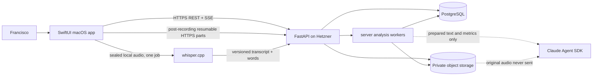

# TAM Forge Native macOS Redesign

**Status:** Locked — D1–D3 approved on 2026-08-28

**Date:** 2026-08-28

**Supersedes:** The client, recorder, recording transport, and speech-runtime portions of `2026-08-25-tam-forge-product-architecture-design.md`

**Preserves:** The product purpose, curriculum rules, evidence rules, privacy boundaries, English-analysis contract, subscription-only AI policy, PostgreSQL/object-storage authority, and explicit approval gates from the approved design

## 1. Outcome

TAM Forge becomes one native SwiftUI macOS application. It replaces both the React/Vite client and the Python/Tkinter recorder while retaining the FastAPI, PostgreSQL, and private object-storage backend on Hetzner.

The design optimizes for a MacBook Pro with Apple M2, 8 GB unified memory, and limited free disk. English-analysis quality is protected by measurement gates. Resource limits change scheduling, not accuracy silently. Complexity or resource cost must earn a meaningful improvement on Francisco's private voice gold set.

## 2. Verified starting point

- `main` is clean at `6cdced2104cd2239011d1212c82ba4d73728851b`.
- The FastAPI backend already implements owner-restricted GitHub OAuth, roadmap import/versioning, Today, activities, evidence, notifications/SSE, object-storage ports, and a durable PostgreSQL job queue with leases and retries.
- The current React/Vite client implements Today, roadmap administration, activity workspace, evidence, and notifications. It remains the behavioral parity reference until native cutover.
- `codex/recording-speech` contains unmerged protocol and persistence experiments. They assume Python, WSS, 44.1 kHz PCM frames, and a separate recorder identity. They are reference material only; they are not a merge base for the new recording path.
- The Mac has Swift 6.2.3 command-line tools but not full Xcode. Full Xcode is a mandatory implementation prerequisite.
- Read-only revalidation on 2026-08-28 found `origin/main` still at `6cdced2104cd2239011d1212c82ba4d73728851b`; GitHub has 114 managed issues, 97 open and 17 closed; the current manifest dry-run reports zero drift. Execution must revalidate these facts immediately before issue migration.

## 3. Locked platform and dependency boundary

| Layer | Decision |
|---|---|
| UI | Swift 6 + SwiftUI, minimum macOS 15 |
| Capture | ScreenCaptureKit with the broadest authorized all-Mac shareable-audio filter and separate `.audio` and `.microphone` outputs; Core Audio/AVFoundation only for device inspection and conversion |
| Networking | Generated Swift OpenAPI client plus `URLSession`; a small native SSE parser where streaming is not generated cleanly |
| Authentication | System browser through `ASWebAuthenticationSession`, one-time backend exchange, opaque access/refresh tokens, Keychain storage |
| Local speech | Pinned `whisper.cpp` XCFramework; one quantized English Base or Small model chosen by benchmark |
| Backend | Existing Python 3.12 FastAPI application |
| Permanent state | PostgreSQL and private Hetzner object storage |
| Local state | Keychain secrets, a bounded encrypted recording spool, and tiny non-authoritative preferences only |
| Distribution | One dependency-free `.app` inside a `.dmg`; no Electron, browser runtime, Docker, local PostgreSQL, or local Python |

Third-party client frameworks are not introduced for state management, networking, dependency injection, navigation, or design. Apple frameworks and the two Apple Swift OpenAPI packages are sufficient. `whisper.cpp` is the only native inference runtime.

## 4. System architecture



### 4.1 Native module boundaries

```text
apps/macos/
├── TAMForge.xcodeproj/
├── TAMForge/
│   ├── App/
│   ├── Core/API/
│   ├── Core/Auth/
│   ├── Core/Diagnostics/
│   ├── Core/Persistence/
│   ├── Features/Today/
│   ├── Features/Activities/
│   ├── Features/Evidence/
│   ├── Features/Roadmaps/
│   ├── Features/Notifications/
│   ├── Recording/
│   ├── Speech/
│   └── Resources/
├── TAMForgeTests/
└── TAMForgeUITests/
```

- Views render state and send user intent; they do not call HTTP, Keychain, capture, or inference APIs directly.
- `@Observable` feature models run on `@MainActor`. API, recording, spool, upload, and speech coordinators are actors with narrow protocols and injected clocks/filesystems/transports for tests.
- Backend state is authoritative. General study data is not mirrored into a local database.
- Recording remains available while offline because the encrypted spool is the temporary source of truth. Other workspace features show explicit retryable network states; full offline editing is deferred until demonstrated necessary.

## 5. Native authentication

The existing cookie/CSRF browser session remains during migration but is not copied into the native client.

1. The app creates state and a PKCE verifier/challenge.
2. An unauthenticated backend endpoint returns a short-lived authorization URL bound to that challenge and the fixed `tamforge` callback scheme.
3. `ASWebAuthenticationSession` opens the default browser. GitHub still redirects only to the FastAPI callback.
4. After verifying the immutable GitHub owner ID, the backend redirects a one-time, two-minute exchange code to the app.
5. The app exchanges the code and PKCE verifier for opaque credentials.
6. The access token is short-lived and memory-only. A rotating refresh token is stored in Keychain. The backend stores hashes only and supports device/session revocation.
7. FastAPI dependencies accept either the existing cookie+CSRF channel or the native bearer channel. Bearer requests never bypass owner scoping, audit, idempotency, or permission checks.

No GitHub token, client secret, refresh token, or spool key is stored in preferences, logs, crash reports, or source control.

## 6. Recording contract

### 6.1 Capture

- **Locked scope:** While a recording is active, the default mode captures all macOS-shareable application audio routed through the Mac plus the selected microphone. It is not configured for only Zoom, Teams, Meet, a browser, or one selected application. It also includes TAM Forge's own TTS/interviewer audio so the permanent original is complete; the app never live-monitors captured audio back through the output device.
- Prefer one broad display-scoped `SCStream` producing separate system-audio and microphone sample buffers. E3-I02 must prove whether application audio coverage remains complete across internal/external-display placement. Add another stream only if that evidence shows it is required and duplicate audio can be prevented deterministically. No BlackHole device or aggregate-device setup is required.
- The app does not retain video frames. ScreenCaptureKit is used only because it supplies authorized system audio and microphone audio on a shared media timeline.
- Canonical permanent tracks are 48 kHz lossless PCM: microphone mono and system audio stereo. Every manifest records actual source format, conversion version, channel mapping, presentation timestamps, sample positions, gaps, and discontinuities.
- Capture callbacks validate and copy bounded sample data only. Conversion, encryption, hashing, and disk I/O occur outside the callback on dedicated actors.
- A device/permission preflight persists no private audio. It verifies microphone permission, screen/audio permission, available input, actual input bandwidth, clipping/level health, free-space reserve, broad application coverage for the current display/audio configuration, and that no transcription job is active; any short in-memory probe is discarded immediately.
- A low-bandwidth Bluetooth hands-free microphone or other degraded input produces a quality warning and is recorded in lineage. Capture remains available for an irreplaceable conversation, but pronunciation is never presented as decision-grade from unsupported audio; the UI recommends the built-in or a proven external microphone when appropriate.
- A persistent in-app recording indicator, elapsed time, and live health for both tracks remain visible. Real-interview recording requires an explicit confirmation that any required participant consent has been obtained; the app never hides recording or bypasses macOS privacy permission.
- “All Mac audio” means all audio macOS exposes to ScreenCaptureKit during the active session. DRM/protected media, an application or route that macOS does not expose, sound outside the Mac that does not reach the selected microphone, and audio before Start or after Stop are outside the technical contract. Missing/zero-level tracks, route changes, and discontinuities produce a visible warning and manifest evidence rather than a false success state.
- Acceptance covers Zoom, Teams, Meet/browser calls, TAM Forge interviewer/TTS audio, ordinary browser/local playback, foreground/background/minimized app placement, headphones and speakers, microphone and output-route changes, sleep/wake, and internal/external display configurations. A configuration that cannot prove both required tracks must block recording or identify the uncovered source explicitly.

### 6.2 Quality-versus-cost gate

The release format starts with 48 kHz signed PCM16 because it is lossless, standard for speech, and approximately 1.04 GB/hour for microphone mono plus system stereo. PCM24 is approximately 1.56 GB/hour and Float32 approximately 2.07 GB/hour.

PCM24 replaces PCM16 only if blinded gold-set evaluation shows a meaningful improvement in at least one primary outcome—critical-word recovery, pronunciation/alignment reliability, or human-rated intelligibility—without merely changing inaudible waveform detail. A change smaller than measurement uncertainty does not justify 50% more disk, upload, and permanent storage.

### 6.3 Encrypted temporary spool

- Each recording receives a random AES-GCM key stored in Keychain.
- Track files are append-only sequences of independently authenticated records of at most one second. Associated data binds recording ID, track, sequence, sample range, and format. A crash can discard only an incomplete trailing record; completed records remain verifiable.
- The manifest is crash-recoverable and content-addressed. Recovery never guesses missing samples; gaps are explicit.
- Initial limits are a 120-minute recording maximum, approximately 2.5 GiB per recording at PCM16 including overhead, a 5 GiB global spool cap, and at least 8 GiB of free-disk reserve. The app refuses to start when the full configured session cannot fit.
- A pending spool is never silently evicted. Old pending recordings become `NeedsAttention` and require explicit retry or discard.

### 6.4 Upload and server acknowledgement

- Upload begins after capture stops. `URLSessionUploadTask` sends bounded file-backed HTTPS parts directly to FastAPI. There is no live WSS stream in the first native release.
- Every part is idempotent and carries a content hash and immutable track range. The backend acknowledges a part only after object persistence and the matching PostgreSQL transaction.
- Seal requests contain the complete versioned manifest and whole-track hashes. The final `201 Created` means both permanent track objects and the database recording aggregate are durable and hash-verified.
- Server reconciliation handles duplicate parts, gaps, retries, interrupted finalization, and orphan objects. It never chooses between conflicting bytes.

## 7. Local transcription and resource policy

### 7.1 Processing order

1. Stop and seal local capture.
2. Upload and obtain durable server `201 Created`.
3. Derive 16 kHz mono signed PCM16 strictly for ASR.
4. Run one local transcription job.
5. Persist transcript, word timestamps, model/config hashes, quality metadata, and correction lineage to FastAPI.
6. Release the whisper context and all owned model/audio buffers.
7. Satisfy the approved local-deletion gate and crypto-shred the spool key before deleting spool bytes.

Microphone speech is always transcribed. System audio is transcribed only when authoritative prompt/question text is unavailable, such as a real interview. Known practice prompts reuse their versioned source text.

### 7.2 Model selection

- Benchmark `base.en` and `small.en` with the same documented `whisper.cpp` quantization level, Metal path, and optional Core ML encoder path.
- Use Francisco's private adjudicated voice set across quiet speech, normal room noise, fast answers, pauses, non-native pronunciation, and TAM terminology.
- Select Small only if it materially reduces meaning-changing errors, absolute WER, or critical-term misses. If results are practically tied, ship Base.
- The selected model is fixed per release and stored with every transcript. Memory pressure never causes an automatic lower-accuracy model substitution.
- Only one model ships in the final app. Build tooling fetches pinned source/model artifacts with hashes; no compiler, Python runtime, or model download is required on the installed Mac.

### 7.3 Initial 8 GB gates

| State | Initial gate |
|---|---|
| Idle after settling | p95 RSS at or below 180 MiB |
| Two-track recording | p95 RSS at or below 300 MiB and no duration-linked growth |
| Transcription | total app peak at or below 1.5 GiB, one job, no recording |
| Cleanup | owned model context and buffers released; RSS returns to within 100 MiB of pre-job baseline within 30 seconds unless an OS-managed cache is documented |
| Pressure | warning defers new work; critical aborts safely, releases owned memory, and leaves a resumable spool |
| Thermal | serious/critical defers a new inference job |

These are release gates, not promises about undocumented macOS cache behavior. The app can guarantee destruction of its context and references; benchmark evidence must prove the observed process behavior.

## 8. English-analysis separation

| Dimension | Primary evidence |
|---|---|
| Transcription | Local whisper.cpp words/timestamps, WER, critical-term recall, human corrections |
| Fluency | VAD and word timing: pace, silent/filled pauses, fillers, restarts, and latency |
| Pronunciation | Original 48 kHz microphone audio plus a dedicated forced-alignment/GOP or equivalent calibrated pipeline; ASR probability is supplementary only |
| Grammar | Versioned text rubric over corrected transcript, with cited spans and uncertainty |
| Vocabulary | Lexical range, specificity, repetition, and TAM-term use over corrected transcript |
| Listening | Versioned stimulus/question plus proposition coverage in the answer; `N/A` when no valid stimulus contract exists |
| Communication effectiveness | Evidence-linked rubric for structure, directness, completeness, audience fit, and recovery |
| TAM judgment | Separate domain rubric and evidence; never blended into English scoring |

Pronunciation remains `not_measured` until a candidate passes calibration against human labels. No accent scoring is introduced. Original audio is never submitted to Claude.

The dedicated pronunciation/alignment pipeline runs on the Hetzner worker, not on the 8 GB Mac. Its candidate gate includes server CPU, memory, latency, privacy, licensing, and incremental cost. The synchronized system track is used only as an echo/crosstalk reference: contaminated and overlapping microphone spans are flagged, never silently rewritten. Pronunciation excludes unsupported spans or remains `not_measured`. Neural source separation is deferred unless the private gold set proves that this lighter method is insufficient.

## 9. SwiftUI migration and cutover

- Add the native app beside `apps/web`; do not delete the working parity reference first.
- Migrate authentication, shell, Today, notifications, roadmaps, activity workspace, and evidence in dependency order.
- Preserve exact backend domain rules: independent Attempt A, self-review before AI feedback, immutable evidence, protected time rules, and explicit roadmap activation.
- Use native controls, keyboard navigation, VoiceOver labels, reduced-motion behavior, actionable loading/error/empty states, and English-only product text.
- Run API contract, unit, integration, UI, accessibility, and measured launch/idle checks on the native target.
- Remove React/Vite, pnpm/Node CI, TypeScript OpenAPI generation, and web deployment only after a signed parity checklist passes against the same backend fixtures. Historical closed web issues remain closed.

## 10. Server and operational boundary

- FastAPI remains the only application backend. Recording adds REST endpoints and persistence to the existing modular application.
- PostgreSQL remains authoritative for identity, lifecycle, transcript lineage, evidence, jobs, and audit.
- Object storage keeps immutable original audio, manifests, derived media, reports, and exports. Object keys contain IDs/hashes, never prompt, company, or transcript text.
- The existing PostgreSQL job queue is reused for server work. The Mac uses a small local actor over the spool for local ASR; it does not run a second general-purpose database queue.
- One-user scale does not justify Redis, Kafka, a second backend, direct-to-object-storage multipart upload, diarization of the already-separated user/system tracks, or a local database in the initial release.

## 11. Verification and release evidence

Release evidence must include:

- deterministic Swift unit tests and backend unit tests without Docker;
- CI macOS build/test on the exact final head;
- approved PostgreSQL/object-store integration checks in isolated CI or after explicit local Docker approval;
- permission, device change, network loss, app crash, disk pressure, duplicate part, reordered part, corrupt ciphertext, corrupt upload, and server restart tests;
- 10-, 60-, and 120-minute recording measurements on this M2/8 GB Mac;
- Base-versus-Small and PCM16-versus-PCM24 private evaluation reports with only aggregate/redacted results committed;
- accessibility and behavioral parity checklist for every migrated page;
- signature, entitlements, bundle-content, dependency, DMG install, permission persistence, and clean-user smoke evidence;
- exact final head review and CI. Missing CI is not green; merge and deployment remain separate approvals.

## 12. Issue migration policy

1. Add E10, **Native macOS application and web parity**, to M0 rather than reopening completed React issues or overloading the recording epic.
2. Keep closed E1/E2 issues as historical evidence.
3. Rewrite open E3 in place for ScreenCaptureKit, encrypted spool, HTTPS upload, and stable packaging.
4. Rewrite open E4 in place for local whisper.cpp and the 8 GB resource policy. Reuse the durable queue already merged on `main`; E4-I01 remains open for speech-specific job registration, worker orchestration, priority, and recovery.
5. Keep E5–E9 product/domain intent, replace web verification with Swift/backend evidence where applicable, and rename E6-I08 to make server-side embeddings explicit.
6. Add `area/macos`; retain `area/web` only for historical closed issues until cutover.
7. Extend every executable child issue with owner, model, effort, reason, dispatch gate, and escalation triggers. Epics summarize child routes and are not executed as standalone tickets.
8. Preserve `codex/recording-speech` until the replacement recording contracts land, then archive/delete it only through normal non-destructive Git cleanup.

## 13. Material decisions to lock

### D1 — Issue shape

**Decision:** Approved on 2026-08-28.

**Recommendation:** Add E10 to M0 with ten native migration children. Keep E3 focused on recording and E4 focused on speech.

Alternative: fold all native UI work into E3. This creates one oversized epic, weakens ownership, and makes recording risk harder to review. Reversible before GitHub sync; expensive afterward.

**Affected tickets:** E10-I01 and every new E10 child; no completed E1/E2 child is reopened.

### D2 — Local deletion gate

**Decision:** Approved on 2026-08-28.

**Recommendation:** Delete the encrypted local original only after both conditions hold: permanent audio has server `201 Created`, and the local transcript plus lineage has been accepted by the backend. If transcription fails after audio upload, retain the bounded encrypted spool for retry.

Alternative: delete immediately after audio `201`. This matches the shortest reading of the earlier rule but can make a local ASR failure unrecoverable without downloading the original again.

**Affected tickets:** E3-I05, E3-I06, E3-I09, E4-I04, E4-I05, and E4-I12. The recommendation costs only bounded encrypted disk during a failed/pending transcript and is reversible later through a versioned retention-policy change.

### D3 — Local signing identity

**Decision:** Approved on 2026-08-28.

**Recommendation:** Replace ad-hoc signing with one stable local self-signed code-signing identity for this single Mac, and make cross-build microphone/screen-permission persistence a hard smoke gate. If that gate fails, use Apple Development signing. Defer the paid Developer ID/notarization path until distribution beyond this Mac is needed.

Alternatives: ad-hoc signing risks repeated privacy prompts after builds; a paid Apple Developer membership provides the cleanest Developer ID/notarized distribution but adds recurring cost before it is necessary.

**Affected tickets:** E10-I02, E10-I04, E3-I02, and E3-I12. The local certificate is reversible; changing identity requires re-signing and may require granting macOS permissions again.

## 14. Primary technical references

- Apple ScreenCaptureKit overview and content filtering: <https://developer.apple.com/documentation/screencapturekit>
- Apple ScreenCaptureKit sample and macOS 15 microphone output: <https://developer.apple.com/documentation/screencapturekit/capturing-screen-content-in-macos>
- Apple ScreenCaptureKit audio-capture configuration: <https://developer.apple.com/documentation/screencapturekit/scstreamconfiguration/capturesaudio>
- Apple code identity and privacy-permission behavior: <https://developer.apple.com/documentation/technotes/tn3127-inside-code-signing-requirements>
- Apple local/self-signed code-signing background: <https://developer.apple.com/library/archive/technotes/tn2206/_index.html>
- Swift OpenAPI Generator: <https://github.com/apple/swift-openapi-generator>
- URLSession transport: <https://github.com/apple/swift-openapi-urlsession>
- whisper.cpp Apple Silicon, quantization, memory, Core ML, and VAD: <https://github.com/ggml-org/whisper.cpp>
- Apple Keychain Services: <https://developer.apple.com/documentation/security/keychain-services/>
- Apple AES-GCM sealed boxes: <https://developer.apple.com/documentation/cryptokit/aes/gcm/sealedbox>
- Apple URLSession uploads: <https://developer.apple.com/documentation/foundation/urlsession>
