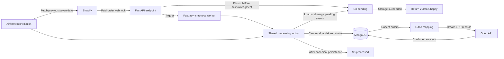

# Shopify to Odoo Integration Case

## Business objective

Automatically create Odoo ERP sales orders from paid Shopify purchases so operations and finance can process orders without manual re-entry. The integration reduces duplicate entry, human error, and the delay before order data becomes available in Odoo.

## Systems

- Shopify — e-commerce source
- FastAPI — webhook receiver
- AWS S3 pending area — durable raw-event storage
- Fast asynchronous worker — webhook-triggered processing
- Shared processing action — common transformation and delivery logic
- MongoDB — canonical integration model and processing status
- Odoo API — ERP destination
- AWS S3 processed area — archive for processed raw events
- Airflow — scheduled reconciliation

## Architecture

## Real-time webhook path

1. Shopify sends a paid-order webhook to FastAPI.
2. FastAPI saves the raw payload durably in the pending S3 area.
3. FastAPI returns `200 OK` only after storage succeeds.
4. If storage fails, FastAPI returns a server error so delivery can be retried.
5. FastAPI triggers a faster asynchronous worker rather than holding the HTTP request open through downstream processing.
6. The worker calls the shared processing action.
7. The action loads previously unprocessed S3 orders and combines them with the newly delivered payload.
8. It filters orders already sent to Odoo and must deduplicate the combined collection.
9. It maps new orders into the canonical MongoDB model.
10. Canonically persisted raw payloads move to the processed S3 area.
11. Unsent MongoDB orders are mapped to the Odoo model and sent.
12. Confirmed Odoo deliveries are marked as sent in MongoDB.

The synchronous contract ends with durable acceptance, not successful Odoo creation. A `200` returned to Shopify means the webhook was safely accepted; it does not mean the complete business process finished.

## Scheduled reconciliation path

1. Airflow retrieves Shopify orders from the previous seven-day window.
2. Airflow passes those orders into the same shared action.
3. The action also loads unprocessed S3 orders.
4. It merges the polled and pending collections.
5. It skips orders already sent to Odoo and processes missing or unsent orders.

Airflow is not used for immediate webhook execution because starting its pod took approximately one minute. The faster worker provides lower webhook latency, while Airflow provides a scheduled safety net.

## Customer and cancellation behavior

- Customer information is captured from the Shopify order.
- The integration searches for the customer in Odoo and creates the customer if necessary.
- If an order is cancelled later in Shopify, the integration sends a credit-note document to Odoo.
- There is no Odoo-to-Shopify return flow in this integration.

## Sources of truth

| Information | Source of truth |
|---|---|
| Original online order | Shopify |
| Customer information submitted with the order | Shopify |
| Raw received event | S3 |
| Integration processing and sent status | MongoDB |
| ERP customer record | Odoo |
| ERP sales order | Odoo |
| Accounting and credit notes | Odoo |
| Fulfillment and delivery | Shopify |

## Five important failure modes

### 1. Duplicate order inside the merged collection

The same order may appear in the webhook payload, polling results, and pending S3 objects before any copy is marked as sent. Deduplicate the combined collection by a stable Shopify order identifier and enforce uniqueness where possible.

### 2. Odoo succeeds before MongoDB records success

Odoo may create the order, followed by a worker crash before MongoDB is marked as sent. A retry could create a duplicate. Before retrying an uncertain result, check Odoo using the stable external order identifier.

### 3. One invalid order blocks a batch

A missing product, invalid tax, unsupported currency, or malformed order could stop the combined batch. Isolate processing per order, quarantine permanent failures, and continue with valid orders.

### 4. Shared-action defect affects both paths

The fast worker and Airflow use the same processing action. This prevents logic drift, but a deterministic defect affects both real-time processing and reconciliation. Polling protects against missed delivery; it does not protect against shared-code defects. Raw S3 events and replay capability provide another recovery layer.

### 5. Odoo is unavailable or rejects the request

Timeouts, authentication failures, rate limits, validation errors, or server failures can leave orders unsent. Preserve the unsent state, separate temporary from permanent failures, retry safely with controlled backoff, and alert on backlog growth.

## Reconciliation and recovery evidence

- Raw payloads remain available in S3.
- MongoDB records canonical orders and delivery state.
- Scheduled polling covers a rolling seven-day Shopify window.
- Real-time alerts surface immediate failures.
- Weekly reports expose unresolved orders to the integration team and customer.
- Retries use backoff and jitter, with a reported policy of approximately seven retries over three days; verify the exact policy before quoting it in an interview.

## Key TAM explanation

> We separated durable webhook acceptance from downstream processing. The API stores the raw event before acknowledging Shopify and delegates the slower work asynchronously. Scheduled reconciliation provides delivery redundancy. Because both execution paths share the same processing action, replayable raw events, per-order state, deduplication, monitoring, and failure isolation are also required.

## Open design checks

- Confirm exactly where deduplication happens relative to the merge.
- Confirm unique external-order constraints in MongoDB and Odoo.
- Confirm how a worker restart guarantees another scan of pending S3 objects.
- Confirm the exact retry schedule before using it as a factual interview claim.

## Practice evidence

- [[Day01_Case01_Shopify-to-Odoo_Coached-Practice-01 - Transcript]]
- [[Day01_Case01_Shopify-to-Odoo_Coached-Practice-01 - Analysis]]

